# Hades Messaging -- Architecture Reference

  
  

> Version 1.0 -- Last updated 2026-03-27
> Canonical source: `docs/ARCHITECTURE.md`

This document contains the complete technical architecture of Hades Messaging
expressed as Mermaid diagrams. Every diagram is self-contained and can be
rendered by GitHub, MkDocs, or any Mermaid-compatible viewer.

---

## Table of Contents

1. [System Overview](#1-system-overview)
2. [Client Architecture](#2-client-architecture)
3. [Rust Crate Dependency Graph](#3-rust-crate-dependency-graph)
4. [Frontend Component Tree](#4-frontend-component-tree)
5. [PQXDH Key Exchange Protocol](#5-pqxdh-key-exchange-protocol)
6. [Double Ratchet Message Encryption](#6-double-ratchet-message-encryption)
7. [Sealed Sender v2 Envelope](#7-sealed-sender-v2-envelope)
8. [Complete Message Lifecycle](#8-complete-message-lifecycle)
9. [Onion Routing and Tor Circuit](#9-onion-routing-and-tor-circuit)
10. [Cover Traffic and Traffic Analysis Resistance](#10-cover-traffic-and-traffic-analysis-resistance)
11. [Identity and Key Management](#11-identity-and-key-management)
12. [Multi-Device Sesame Synchronization](#12-multi-device-sesame-synchronization)
13. [Anti-Forensics and Secure Storage](#13-anti-forensics-and-secure-storage)
14. [Sovereign Infrastructure Deployment](#14-sovereign-infrastructure-deployment)
15. [Connection State Machine](#15-connection-state-machine)
16. [Message Delivery State Machine](#16-message-delivery-state-machine)
17. [Pluggable Transport Selection](#17-pluggable-transport-selection)
18. [Bridge Auto-Rotation Lifecycle](#18-bridge-auto-rotation-lifecycle)
19. [Emergency Wipe Sequence](#19-emergency-wipe-sequence)
20. [CI/CD Release Pipeline](#20-cicd-release-pipeline)
21. [Threat Model Adversary Classes](#21-threat-model-adversary-classes)
22. [Data Flow Classification](#22-data-flow-classification)
23. [Key Hierarchy](#23-key-hierarchy)

---

## 1. System Overview

The highest-level view of every major subsystem and how they communicate.

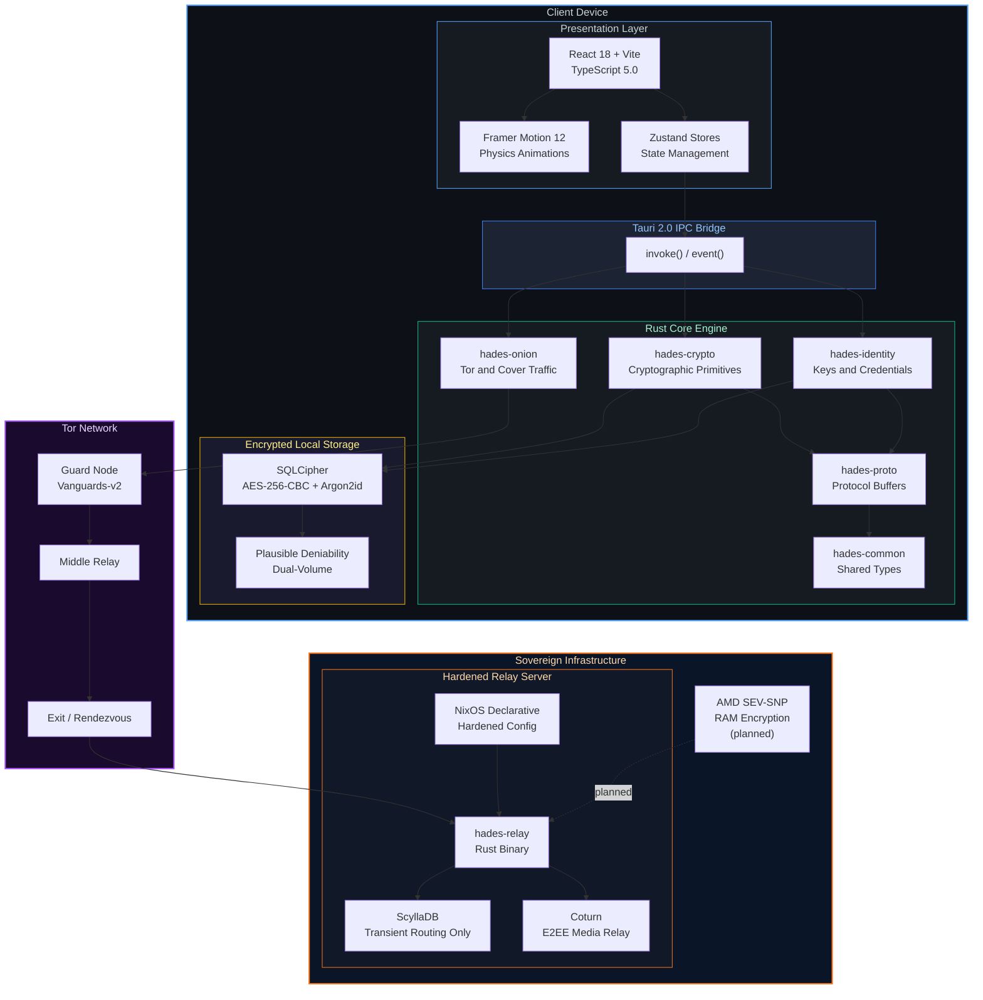
```mermaid
graph TB
    subgraph CLIENT["Client Device"]
        direction TB
        subgraph UI_LAYER["Presentation Layer"]
            REACT["React 18 + Vite<br/>TypeScript 5.0"]
            FRAMER["Framer Motion 12<br/>Physics Animations"]
            ZUSTAND["Zustand Stores<br/>State Management"]
        end

        subgraph TAURI_BRIDGE["Tauri 2.0 IPC Bridge"]
            IPC["invoke() / event()"]
        end

        subgraph RUST_CORE["Rust Core Engine"]
            CRYPTO["hades-crypto<br/>Cryptographic Primitives"]
            IDENTITY["hades-identity<br/>Keys and Credentials"]
            ONION["hades-onion<br/>Tor and Cover Traffic"]
            PROTO["hades-proto<br/>Protocol Buffers"]
            COMMON["hades-common<br/>Shared Types"]
        end

        subgraph LOCAL_STORAGE["Encrypted Local Storage"]
            SQLCIPHER["SQLCipher<br/>AES-256-CBC + Argon2id"]
            DENIABLE["Plausible Deniability<br/>Dual-Volume"]
        end
    end

    subgraph TOR_NETWORK["Tor Network"]
        GUARD["Guard Node<br/>Vanguards-v2"]
        MIDDLE["Middle Relay"]
        EXIT["Exit / Rendezvous"]
    end

    subgraph SOVEREIGN["Sovereign Infrastructure"]
        subgraph RELAY_SERVER["Hardened Relay Server"]
            NIXOS["NixOS Declarative<br/>Hardened Config"]
            RELAY_RUST["hades-relay<br/>Rust Binary"]
            SCYLLA["ScyllaDB<br/>Transient Routing Only"]
            COTURN_SRV["Coturn<br/>E2EE Media Relay"]
        end
        SEV["AMD SEV-SNP<br/>RAM Encryption<br/>(planned)"]
    end

    REACT --> FRAMER
    REACT --> ZUSTAND
    ZUSTAND --> IPC
    IPC --> CRYPTO
    IPC --> IDENTITY
    IPC --> ONION
    CRYPTO --> PROTO
    IDENTITY --> PROTO
    PROTO --> COMMON
    CRYPTO --> SQLCIPHER
    IDENTITY --> SQLCIPHER
    SQLCIPHER --> DENIABLE
    ONION --> GUARD
    GUARD --> MIDDLE
    MIDDLE --> EXIT
    EXIT --> RELAY_RUST
    RELAY_RUST --> SCYLLA
    RELAY_RUST --> COTURN_SRV
    NIXOS --> RELAY_RUST
    SEV -.->|planned| RELAY_RUST

    style CLIENT fill:#0d1117,stroke:#58a6ff,stroke-width:2px,color:#c9d1d9
    style TOR_NETWORK fill:#1a0a2e,stroke:#a855f7,stroke-width:2px,color:#e9d5ff
    style SOVEREIGN fill:#0a1628,stroke:#f97316,stroke-width:2px,color:#fed7aa
    style RELAY_SERVER fill:#111827,stroke:#f97316,stroke-width:1px,color:#fed7aa
    style UI_LAYER fill:#161b22,stroke:#58a6ff,stroke-width:1px,color:#c9d1d9
    style TAURI_BRIDGE fill:#1c2333,stroke:#3b82f6,stroke-width:1px,color:#93c5fd
    style RUST_CORE fill:#161b22,stroke:#10b981,stroke-width:1px,color:#a7f3d0
    style LOCAL_STORAGE fill:#1a1a2e,stroke:#eab308,stroke-width:1px,color:#fef08a
```

---

## 2. Client Architecture

Detailed internal structure of the Tauri 2.0 client showing every layer
from the UI down to the encrypted store.

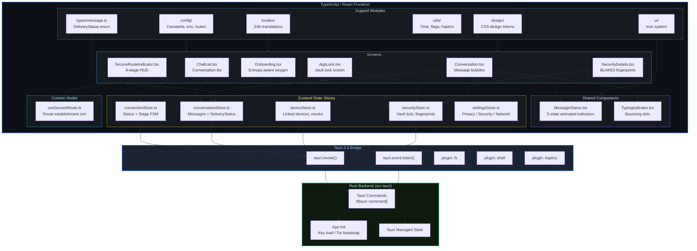
```mermaid
graph TB
    subgraph FRONTEND["TypeScript / React Frontend"]
        direction TB

        subgraph SCREENS["Screens"]
            S_ONBOARD["Onboarding.tsx<br/>Entropy-aware keygen"]
            S_LOCK["AppLock.tsx<br/>Vault lock screen"]
            S_CHATLIST["ChatList.tsx<br/>Conversation list"]
            S_CONVO["Conversation.tsx<br/>Message bubbles"]
            S_ROUTE["SecureRouteIndicator.tsx<br/>8-stage HUD"]
            S_SECURITY["SecurityDetails.tsx<br/>BLAKE3 fingerprints"]
        end

        subgraph COMPONENTS["Shared Components"]
            C_STATUS["MessageStatus.tsx<br/>5-state animated indicators"]
            C_TYPING["TypingIndicator.tsx<br/>Bouncing dots"]
        end

        subgraph STORES["Zustand State Stores"]
            ST_CONN["connectionStore.ts<br/>Status + Stage FSM"]
            ST_CONV["conversationStore.ts<br/>Messages + DeliveryStatus"]
            ST_DEV["deviceStore.ts<br/>Linked devices, revoke"]
            ST_SEC["securityStore.ts<br/>Vault lock, fingerprints"]
            ST_SET["settingsStore.ts<br/>Privacy / Security / Network"]
        end

        subgraph HOOKS["Custom Hooks"]
            H_ROUTE["useSecureRoute.ts<br/>Route establishment sim"]
        end

        subgraph SUPPORT["Support Modules"]
            TYPES["types/message.ts<br/>DeliveryStatus enum"]
            CONFIG["config/<br/>Constants, env, routes"]
            I18N["locales/<br/>i18n translations"]
            UTILS["utils/<br/>Time, flags, haptics"]
            DESIGN["design/<br/>CSS design tokens"]
            ICONS["ui/<br/>Icon system"]
        end
    end

    subgraph TAURI["Tauri 2.0 Bridge"]
        INVOKE["tauri.invoke()"]
        EVENTS["tauri.event.listen()"]
        PLUGIN_FS["plugin: fs"]
        PLUGIN_SHELL["plugin: shell"]
        PLUGIN_HAPTIC["plugin: haptics"]
    end

    subgraph RUST_BACKEND["Rust Backend (src-tauri)"]
        CMD["Tauri Commands<br/>#[tauri::command]"]
        INIT["App Init<br/>Key load / Tor bootstrap"]
        STATE["Tauri Managed State"]
    end

    S_ONBOARD --> ST_SEC
    S_LOCK --> ST_SEC
    S_CHATLIST --> ST_CONV
    S_CONVO --> ST_CONV
    S_CONVO --> C_STATUS
    S_CONVO --> C_TYPING
    S_ROUTE --> ST_CONN
    S_ROUTE --> H_ROUTE
    S_SECURITY --> ST_SEC

    ST_CONN --> INVOKE
    ST_CONV --> INVOKE
    ST_DEV --> INVOKE
    ST_SEC --> INVOKE

    INVOKE --> CMD
    EVENTS --> CMD
    CMD --> INIT
    CMD --> STATE

    TYPES --> ST_CONV
    CONFIG --> SCREENS
    I18N --> SCREENS
    DESIGN --> SCREENS
    ICONS --> COMPONENTS

    style FRONTEND fill:#0d1117,stroke:#58a6ff,stroke-width:2px,color:#c9d1d9
    style TAURI fill:#1c2333,stroke:#3b82f6,stroke-width:2px,color:#93c5fd
    style RUST_BACKEND fill:#0f1a0f,stroke:#10b981,stroke-width:2px,color:#a7f3d0
    style SCREENS fill:#161b22,stroke:#58a6ff,stroke-width:1px,color:#c9d1d9
    style STORES fill:#161b22,stroke:#eab308,stroke-width:1px,color:#fef08a
    style COMPONENTS fill:#161b22,stroke:#8b5cf6,stroke-width:1px,color:#ddd6fe
    style HOOKS fill:#161b22,stroke:#06b6d4,stroke-width:1px,color:#a5f3fc
    style SUPPORT fill:#161b22,stroke:#6b7280,stroke-width:1px,color:#d1d5db
```

---

## 3. Rust Crate Dependency Graph

Internal dependency relationships between every Rust crate in the workspace.

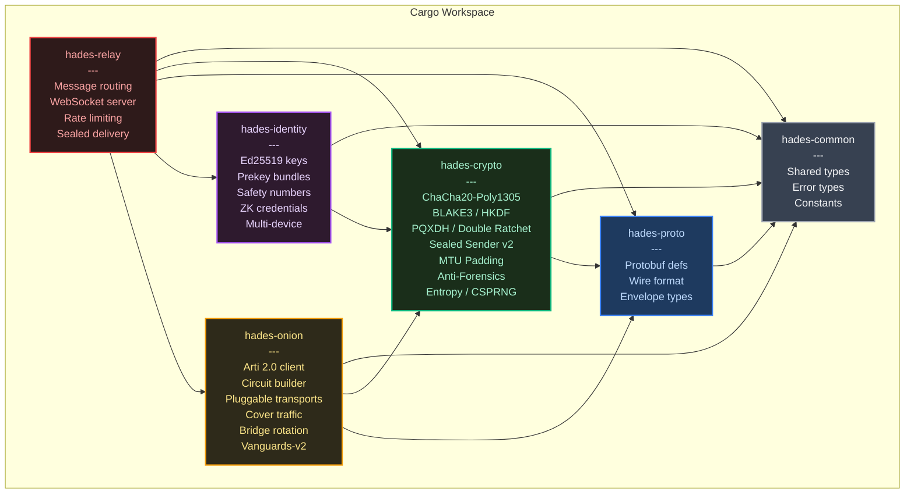
```mermaid
graph LR
    subgraph WORKSPACE["Cargo Workspace"]
        direction LR

        COMMON["hades-common<br/>---<br/>Shared types<br/>Error types<br/>Constants"]

        PROTO["hades-proto<br/>---<br/>Protobuf defs<br/>Wire format<br/>Envelope types"]

        CRYPTO["hades-crypto<br/>---<br/>ChaCha20-Poly1305<br/>BLAKE3 / HKDF<br/>PQXDH / Double Ratchet<br/>Sealed Sender v2<br/>MTU Padding<br/>Anti-Forensics<br/>Entropy / CSPRNG"]

        IDENTITY["hades-identity<br/>---<br/>Ed25519 keys<br/>Prekey bundles<br/>Safety numbers<br/>ZK credentials<br/>Multi-device"]

        ONION["hades-onion<br/>---<br/>Arti 2.0 client<br/>Circuit builder<br/>Pluggable transports<br/>Cover traffic<br/>Bridge rotation<br/>Vanguards-v2"]

        RELAY["hades-relay<br/>---<br/>Message routing<br/>WebSocket server<br/>Rate limiting<br/>Sealed delivery"]
    end

    PROTO --> COMMON
    CRYPTO --> COMMON
    CRYPTO --> PROTO
    IDENTITY --> COMMON
    IDENTITY --> CRYPTO
    ONION --> COMMON
    ONION --> CRYPTO
    ONION --> PROTO
    RELAY --> COMMON
    RELAY --> CRYPTO
    RELAY --> PROTO
    RELAY --> IDENTITY
    RELAY --> ONION

    style COMMON fill:#374151,stroke:#9ca3af,stroke-width:2px,color:#f3f4f6
    style PROTO fill:#1e3a5f,stroke:#3b82f6,stroke-width:2px,color:#bfdbfe
    style CRYPTO fill:#1a2e1a,stroke:#10b981,stroke-width:2px,color:#a7f3d0
    style IDENTITY fill:#2e1a2e,stroke:#a855f7,stroke-width:2px,color:#e9d5ff
    style ONION fill:#2e2a1a,stroke:#f59e0b,stroke-width:2px,color:#fde68a
    style RELAY fill:#2e1a1a,stroke:#ef4444,stroke-width:2px,color:#fca5a5
```

---

## 4. Frontend Component Tree

React component hierarchy rendered inside the Tauri webview.

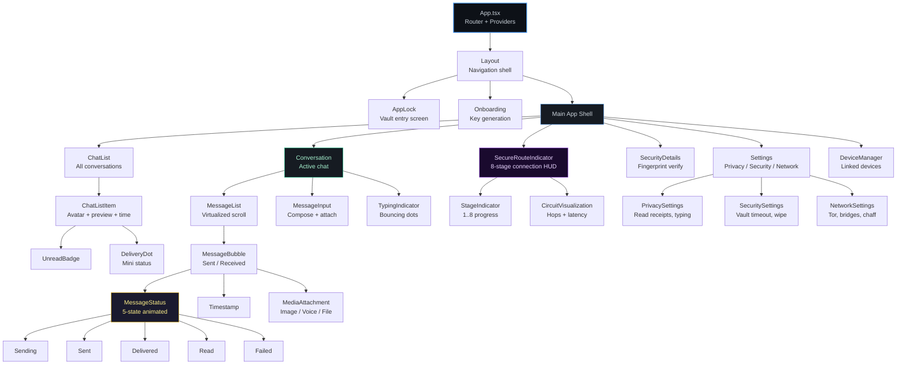
```mermaid
graph TD
    APP["App.tsx<br/>Router + Providers"]

    APP --> LAYOUT["Layout<br/>Navigation shell"]

    LAYOUT --> LOCK["AppLock<br/>Vault entry screen"]
    LAYOUT --> ONBOARD["Onboarding<br/>Key generation"]
    LAYOUT --> MAIN["Main App Shell"]

    MAIN --> ROUTE_HUD["SecureRouteIndicator<br/>8-stage connection HUD"]
    MAIN --> CHATLIST["ChatList<br/>All conversations"]
    MAIN --> CONVO["Conversation<br/>Active chat"]
    MAIN --> SECURITY["SecurityDetails<br/>Fingerprint verify"]
    MAIN --> SETTINGS["Settings<br/>Privacy / Security / Network"]
    MAIN --> DEVICES["DeviceManager<br/>Linked devices"]

    CHATLIST --> CHAT_ITEM["ChatListItem<br/>Avatar + preview + time"]
    CHAT_ITEM --> BADGE["UnreadBadge"]
    CHAT_ITEM --> STATUS_MINI["DeliveryDot<br/>Mini status"]

    CONVO --> MSG_LIST["MessageList<br/>Virtualized scroll"]
    CONVO --> INPUT["MessageInput<br/>Compose + attach"]
    CONVO --> TYPING["TypingIndicator<br/>Bouncing dots"]

    MSG_LIST --> BUBBLE["MessageBubble<br/>Sent / Received"]
    BUBBLE --> MSG_STATUS["MessageStatus<br/>5-state animated"]
    BUBBLE --> TIMESTAMP["Timestamp"]
    BUBBLE --> MEDIA["MediaAttachment<br/>Image / Voice / File"]

    MSG_STATUS --> S1["Sending"]
    MSG_STATUS --> S2["Sent"]
    MSG_STATUS --> S3["Delivered"]
    MSG_STATUS --> S4["Read"]
    MSG_STATUS --> S5["Failed"]

    ROUTE_HUD --> STAGE["StageIndicator<br/>1..8 progress"]
    ROUTE_HUD --> NODE_VIS["CircuitVisualization<br/>Hops + latency"]

    SETTINGS --> PRIV["PrivacySettings<br/>Read receipts, typing"]
    SETTINGS --> SEC["SecuritySettings<br/>Vault timeout, wipe"]
    SETTINGS --> NET["NetworkSettings<br/>Tor, bridges, chaff"]

    style APP fill:#0d1117,stroke:#58a6ff,stroke-width:2px,color:#c9d1d9
    style MAIN fill:#161b22,stroke:#58a6ff,stroke-width:1px,color:#c9d1d9
    style CONVO fill:#161b22,stroke:#10b981,stroke-width:1px,color:#a7f3d0
    style MSG_STATUS fill:#1a1a2e,stroke:#eab308,stroke-width:1px,color:#fef08a
    style ROUTE_HUD fill:#1a0a2e,stroke:#a855f7,stroke-width:1px,color:#e9d5ff
```

---

## 5. PQXDH Key Exchange Protocol

The complete Post-Quantum Extended Diffie-Hellman handshake combining
classical X25519 with ML-KEM-768 for quantum resistance.

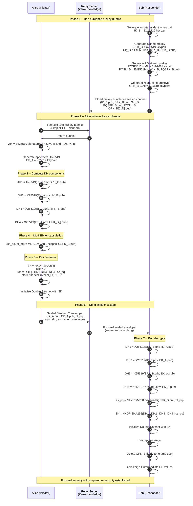
```mermaid
sequenceDiagram
    autonumber
    participant A as Alice (Initiator)
    participant S as Relay Server<br/>(Zero-Knowledge)
    participant B as Bob (Responder)

    Note over A,B: Phase 1 -- Bob publishes prekey bundle

    B->>B: Generate long-term identity key pair<br/>IK_B = Ed25519 keypair
    B->>B: Generate signed prekey<br/>SPK_B = X25519 keypair<br/>Sig_B = Ed25519.sign(IK_B, SPK_B.pub)
    B->>B: Generate PQ signed prekey<br/>PQSPK_B = ML-KEM-768 keypair<br/>PQSig_B = Ed25519.sign(IK_B, PQSPK_B.pub)
    B->>B: Generate N one-time prekeys<br/>OPK_B[0..N] = X25519 keypairs

    B->>S: Upload prekey bundle via sealed channel<br/>{IK_B.pub, SPK_B.pub, Sig_B,<br/> PQSPK_B.pub, PQSig_B,<br/> OPK_B[0..N].pub}

    Note over A,B: Phase 2 -- Alice initiates key exchange

    A->>S: Request Bob prekey bundle<br/>(SimplePIR -- planned)
    S->>A: Return bundle

    A->>A: Verify Ed25519 signatures on SPK_B and PQSPK_B
    A->>A: Generate ephemeral X25519<br/>EK_A = X25519 keypair

    Note over A: Phase 3 -- Compute DH components

    A->>A: DH1 = X25519(IK_A.priv, SPK_B.pub)
    A->>A: DH2 = X25519(EK_A.priv, IK_B.pub)
    A->>A: DH3 = X25519(EK_A.priv, SPK_B.pub)
    A->>A: DH4 = X25519(EK_A.priv, OPK_B[j].pub)

    Note over A: Phase 4 -- ML-KEM encapsulation

    A->>A: (ss_pq, ct_pq) = ML-KEM-768.Encaps(PQSPK_B.pub)

    Note over A: Phase 5 -- Key derivation

    A->>A: SK = HKDF-SHA256(<br/>  salt = 0,<br/>  ikm = DH1 | DH2 | DH3 | DH4 | ss_pq,<br/>  info = "HadesProtocol_PQXDH"<br/>)

    A->>A: Initialize Double Ratchet with SK

    Note over A,B: Phase 6 -- Send initial message

    A->>S: Sealed Sender v2 envelope:<br/>{IK_A.pub, EK_A.pub, ct_pq,<br/> opk_id=j, encrypted_message}

    S->>B: Forward sealed envelope<br/>(server learns nothing)

    Note over B: Phase 7 -- Bob decrypts

    B->>B: DH1 = X25519(SPK_B.priv, IK_A.pub)
    B->>B: DH2 = X25519(IK_B.priv, EK_A.pub)
    B->>B: DH3 = X25519(SPK_B.priv, EK_A.pub)
    B->>B: DH4 = X25519(OPK_B[j].priv, EK_A.pub)
    B->>B: ss_pq = ML-KEM-768.Decaps(PQSPK_B.priv, ct_pq)
    B->>B: SK = HKDF-SHA256(DH1 | DH2 | DH3 | DH4 | ss_pq)
    B->>B: Initialize Double Ratchet with SK
    B->>B: Decrypt message

    B->>B: Delete OPK_B[j].priv (one-time use)
    B->>B: zeroize() all intermediate DH values

    Note over A,B: Forward secrecy + Post-quantum security established
```

---

## 6. Double Ratchet Message Encryption

The symmetric ratchet, DH ratchet, and SPQR post-quantum injection points.

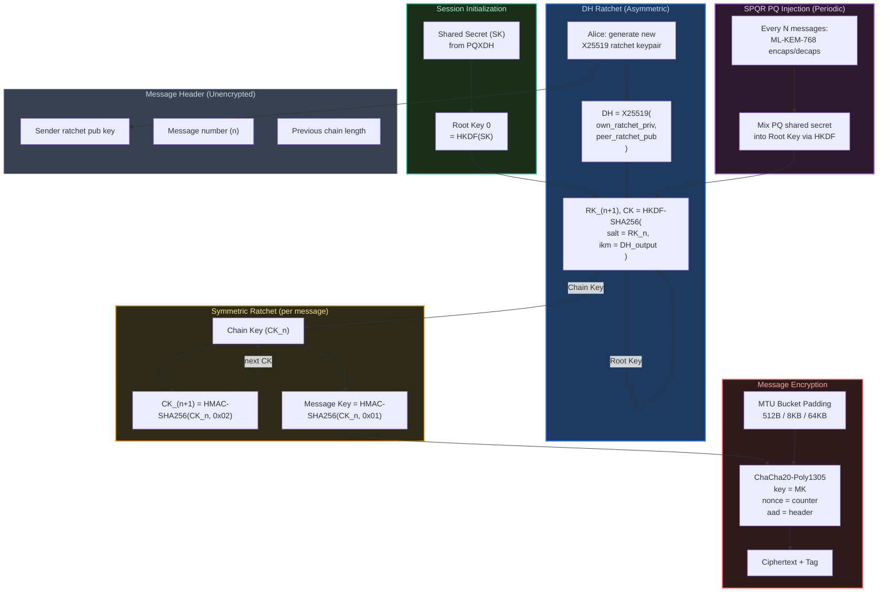
```mermaid
graph TB
    subgraph INIT["Session Initialization"]
        SK["Shared Secret (SK)<br/>from PQXDH"]
        RK_0["Root Key 0<br/>= HKDF(SK)"]
    end

    subgraph DH_RATCHET["DH Ratchet (Asymmetric)"]
        direction TB
        DH_A["Alice: generate new<br/>X25519 ratchet keypair"]
        DH_STEP["DH = X25519(<br/>  own_ratchet_priv,<br/>  peer_ratchet_pub<br/>)"]
        KDF_RK["RK_(n+1), CK = HKDF-SHA256(<br/>  salt = RK_n,<br/>  ikm = DH_output<br/>)"]
    end

    subgraph SYM_RATCHET["Symmetric Ratchet (per message)"]
        direction TB
        CK_N["Chain Key (CK_n)"]
        KDF_CK["CK_(n+1) = HMAC-SHA256(CK_n, 0x02)"]
        MK["Message Key = HMAC-SHA256(CK_n, 0x01)"]
    end

    subgraph ENCRYPT["Message Encryption"]
        PAD["MTU Bucket Padding<br/>512B / 8KB / 64KB"]
        AEAD["ChaCha20-Poly1305<br/>key = MK<br/>nonce = counter<br/>aad = header"]
        CIPHER["Ciphertext + Tag"]
    end

    subgraph SPQR["SPQR PQ Injection (Periodic)"]
        PQ_RATCHET["Every N messages:<br/>ML-KEM-768 encaps/decaps"]
        PQ_MIX["Mix PQ shared secret<br/>into Root Key via HKDF"]
    end

    subgraph HEADER["Message Header (Unencrypted)"]
        HDR_PUB["Sender ratchet pub key"]
        HDR_N["Message number (n)"]
        HDR_PN["Previous chain length"]
    end

    SK --> RK_0
    RK_0 --> KDF_RK
    DH_A --> DH_STEP
    DH_STEP --> KDF_RK
    KDF_RK -->|"Root Key"| KDF_RK
    KDF_RK -->|"Chain Key"| CK_N
    CK_N --> KDF_CK
    CK_N --> MK
    KDF_CK -->|"next CK"| CK_N
    MK --> AEAD
    PAD --> AEAD
    AEAD --> CIPHER

    PQ_RATCHET --> PQ_MIX
    PQ_MIX --> KDF_RK

    DH_A --> HDR_PUB

    style INIT fill:#1a2e1a,stroke:#10b981,stroke-width:2px,color:#a7f3d0
    style DH_RATCHET fill:#1e3a5f,stroke:#3b82f6,stroke-width:2px,color:#bfdbfe
    style SYM_RATCHET fill:#2e2a1a,stroke:#f59e0b,stroke-width:2px,color:#fde68a
    style ENCRYPT fill:#2e1a1a,stroke:#ef4444,stroke-width:2px,color:#fca5a5
    style SPQR fill:#2e1a2e,stroke:#a855f7,stroke-width:2px,color:#e9d5ff
    style HEADER fill:#374151,stroke:#9ca3af,stroke-width:1px,color:#d1d5db
```

---

## 7. Sealed Sender v2 Envelope

The double-sealed metadata encryption that hides both sender and recipient
identities from the relay server.

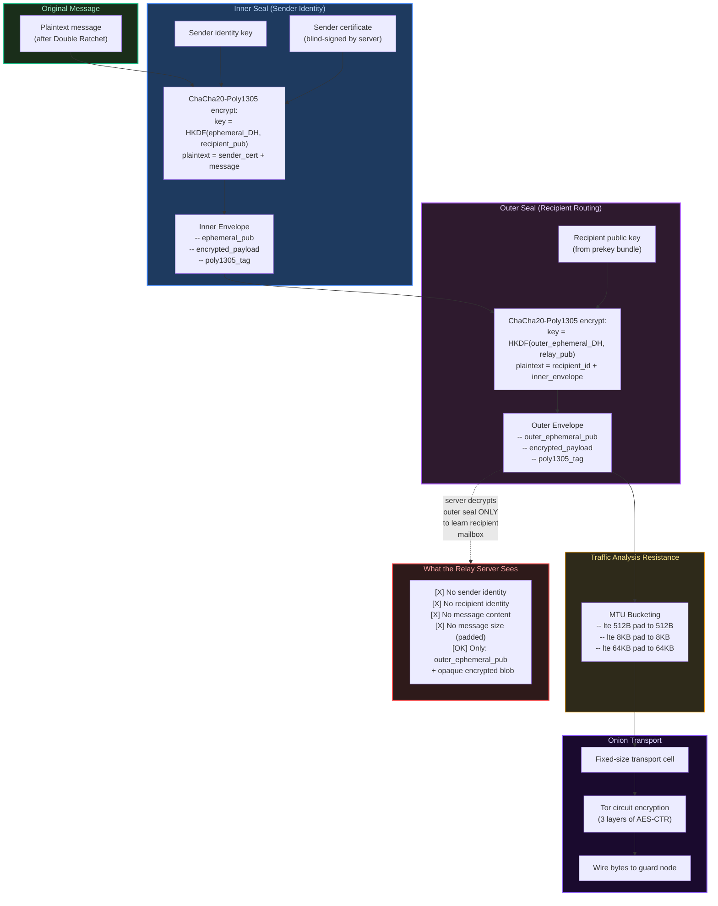
```mermaid
graph TB
    subgraph PLAINTEXT["Original Message"]
        MSG["Plaintext message<br/>(after Double Ratchet)"]
    end

    subgraph INNER_SEAL["Inner Seal (Sender Identity)"]
        direction TB
        SENDER_ID["Sender identity key"]
        SENDER_CERT["Sender certificate<br/>(blind-signed by server)"]
        INNER_ENC["ChaCha20-Poly1305 encrypt:<br/>key = HKDF(ephemeral_DH, recipient_pub)<br/>plaintext = sender_cert + message"]
        INNER_ENV["Inner Envelope<br/>-- ephemeral_pub<br/>-- encrypted_payload<br/>-- poly1305_tag"]
    end

    subgraph OUTER_SEAL["Outer Seal (Recipient Routing)"]
        direction TB
        RECIP_ID["Recipient public key<br/>(from prekey bundle)"]
        OUTER_ENC["ChaCha20-Poly1305 encrypt:<br/>key = HKDF(outer_ephemeral_DH, relay_pub)<br/>plaintext = recipient_id + inner_envelope"]
        OUTER_ENV["Outer Envelope<br/>-- outer_ephemeral_pub<br/>-- encrypted_payload<br/>-- poly1305_tag"]
    end

    subgraph PADDING["Traffic Analysis Resistance"]
        BUCKET["MTU Bucketing<br/>-- lte 512B  pad to 512B<br/>-- lte 8KB   pad to 8KB<br/>-- lte 64KB  pad to 64KB"]
    end

    subgraph TRANSPORT["Onion Transport"]
        CELL["Fixed-size transport cell"]
        TOR["Tor circuit encryption<br/>(3 layers of AES-CTR)"]
        WIRE["Wire bytes to guard node"]
    end

    MSG --> INNER_ENC
    SENDER_ID --> INNER_ENC
    SENDER_CERT --> INNER_ENC
    INNER_ENC --> INNER_ENV
    INNER_ENV --> OUTER_ENC
    RECIP_ID --> OUTER_ENC
    OUTER_ENC --> OUTER_ENV
    OUTER_ENV --> BUCKET
    BUCKET --> CELL
    CELL --> TOR
    TOR --> WIRE

    subgraph SERVER_VIEW["What the Relay Server Sees"]
        NOTHING["[X] No sender identity<br/>[X] No recipient identity<br/>[X] No message content<br/>[X] No message size (padded)<br/>[OK] Only: outer_ephemeral_pub<br/>  + opaque encrypted blob"]
    end

    OUTER_ENV -.->|"server decrypts<br/>outer seal ONLY<br/>to learn recipient<br/>mailbox"| SERVER_VIEW

    style PLAINTEXT fill:#1a2e1a,stroke:#10b981,stroke-width:2px,color:#a7f3d0
    style INNER_SEAL fill:#1e3a5f,stroke:#3b82f6,stroke-width:2px,color:#bfdbfe
    style OUTER_SEAL fill:#2e1a2e,stroke:#a855f7,stroke-width:2px,color:#e9d5ff
    style PADDING fill:#2e2a1a,stroke:#f59e0b,stroke-width:1px,color:#fde68a
    style TRANSPORT fill:#1a0a2e,stroke:#8b5cf6,stroke-width:2px,color:#ddd6fe
    style SERVER_VIEW fill:#2e1a1a,stroke:#ef4444,stroke-width:2px,color:#fca5a5
```

---

## 8. Complete Message Lifecycle

Every step a message takes from composition to delivery and read receipt.

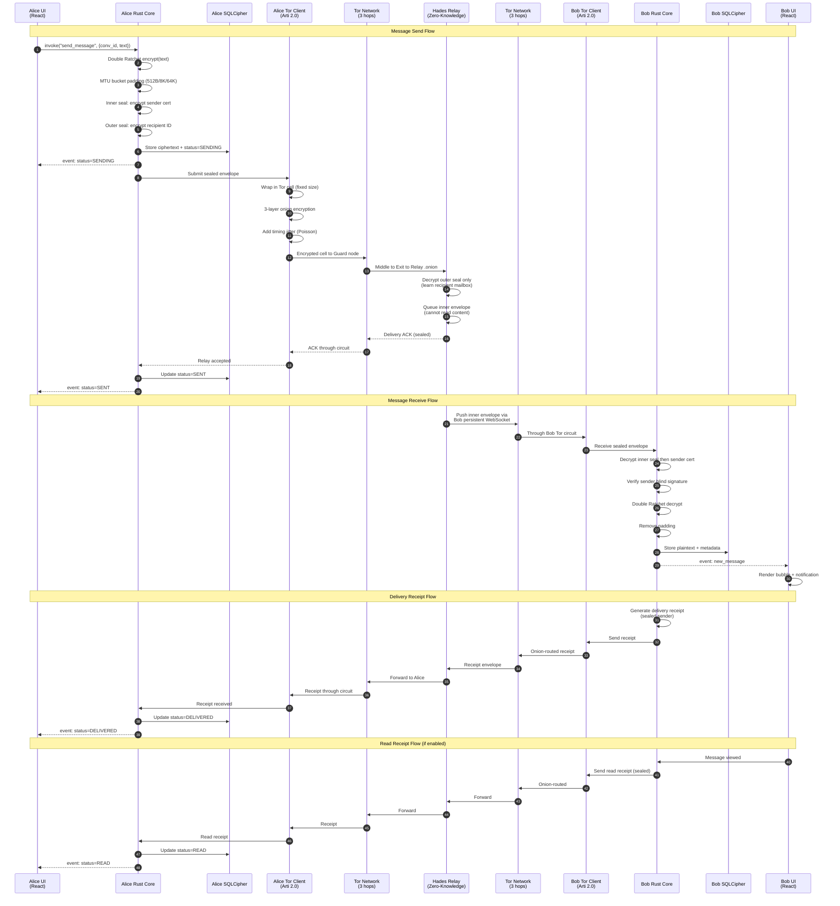
```mermaid
sequenceDiagram
    autonumber
    participant UI_A as Alice UI<br/>(React)
    participant RUST_A as Alice Rust Core
    participant STORE_A as Alice SQLCipher
    participant TOR_A as Alice Tor Client<br/>(Arti 2.0)
    participant NET as Tor Network<br/>(3 hops)
    participant RELAY as Hades Relay<br/>(Zero-Knowledge)
    participant NET_B as Tor Network<br/>(3 hops)
    participant TOR_B as Bob Tor Client<br/>(Arti 2.0)
    participant RUST_B as Bob Rust Core
    participant STORE_B as Bob SQLCipher
    participant UI_B as Bob UI<br/>(React)

    Note over UI_A,UI_B: Message Send Flow

    UI_A->>RUST_A: invoke("send_message", {conv_id, text})
    RUST_A->>RUST_A: Double Ratchet encrypt(text)
    RUST_A->>RUST_A: MTU bucket padding (512B/8K/64K)
    RUST_A->>RUST_A: Inner seal: encrypt sender cert
    RUST_A->>RUST_A: Outer seal: encrypt recipient ID
    RUST_A->>STORE_A: Store ciphertext + status=SENDING
    RUST_A-->>UI_A: event: status=SENDING
    RUST_A->>TOR_A: Submit sealed envelope
    TOR_A->>TOR_A: Wrap in Tor cell (fixed size)
    TOR_A->>TOR_A: 3-layer onion encryption
    TOR_A->>TOR_A: Add timing jitter (Poisson)
    TOR_A->>NET: Encrypted cell to Guard node

    NET->>RELAY: Middle to Exit to Relay .onion

    RELAY->>RELAY: Decrypt outer seal only<br/>(learn recipient mailbox)
    RELAY->>RELAY: Queue inner envelope<br/>(cannot read content)
    RELAY-->>NET: Delivery ACK (sealed)

    NET-->>TOR_A: ACK through circuit
    TOR_A-->>RUST_A: Relay accepted
    RUST_A->>STORE_A: Update status=SENT
    RUST_A-->>UI_A: event: status=SENT

    Note over UI_A,UI_B: Message Receive Flow

    RELAY->>NET_B: Push inner envelope via<br/>Bob persistent WebSocket
    NET_B->>TOR_B: Through Bob Tor circuit
    TOR_B->>RUST_B: Receive sealed envelope
    RUST_B->>RUST_B: Decrypt inner seal then sender cert
    RUST_B->>RUST_B: Verify sender blind signature
    RUST_B->>RUST_B: Double Ratchet decrypt
    RUST_B->>RUST_B: Remove padding
    RUST_B->>STORE_B: Store plaintext + metadata
    RUST_B-->>UI_B: event: new_message

    UI_B->>UI_B: Render bubble + notification

    Note over UI_A,UI_B: Delivery Receipt Flow

    RUST_B->>RUST_B: Generate delivery receipt<br/>(sealed sender)
    RUST_B->>TOR_B: Send receipt
    TOR_B->>NET_B: Onion-routed receipt
    NET_B->>RELAY: Receipt envelope
    RELAY->>NET: Forward to Alice
    NET->>TOR_A: Receipt through circuit
    TOR_A->>RUST_A: Receipt received
    RUST_A->>STORE_A: Update status=DELIVERED
    RUST_A-->>UI_A: event: status=DELIVERED

    Note over UI_A,UI_B: Read Receipt Flow (if enabled)

    UI_B->>RUST_B: Message viewed
    RUST_B->>TOR_B: Send read receipt (sealed)
    TOR_B->>NET_B: Onion-routed
    NET_B->>RELAY: Forward
    RELAY->>NET: Forward
    NET->>TOR_A: Receipt
    TOR_A->>RUST_A: Read receipt
    RUST_A->>STORE_A: Update status=READ
    RUST_A-->>UI_A: event: status=READ
```

---

## 9. Onion Routing and Tor Circuit

How Arti 2.0 builds multi-hop circuits with Vanguards-v2 guard protection.

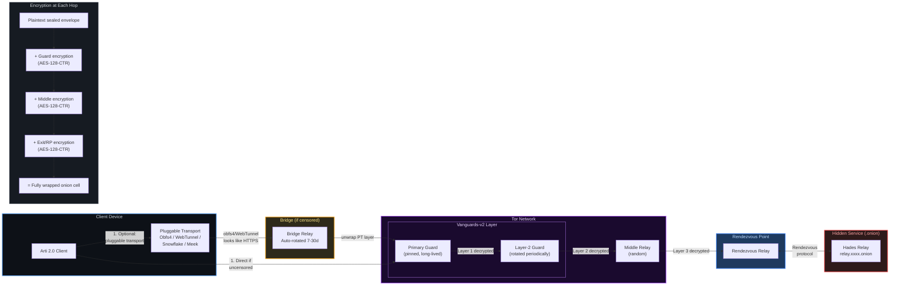
```mermaid
graph LR
    subgraph CLIENT_DEVICE["Client Device"]
        ARTI["Arti 2.0 Client"]
        PT["Pluggable Transport<br/>Obfs4 / WebTunnel /<br/>Snowflake / Meek"]
    end

    subgraph BRIDGE["Bridge (if censored)"]
        BR["Bridge Relay<br/>Auto-rotated 7-30d"]
    end

    subgraph TOR["Tor Network"]
        subgraph VANGUARD["Vanguards-v2 Layer"]
            G1["Primary Guard<br/>(pinned, long-lived)"]
            G2["Layer-2 Guard<br/>(rotated periodically)"]
        end
        M["Middle Relay<br/>(random)"]
    end

    subgraph RENDEZVOUS["Rendezvous Point"]
        RP["Rendezvous Relay"]
    end

    subgraph HIDDEN["Hidden Service (.onion)"]
        HS["Hades Relay<br/>relay.xxxx.onion"]
    end

    ARTI -->|"1. Optional:<br/>pluggable transport"| PT
    PT -->|"obfs4/WebTunnel<br/>looks like HTTPS"| BR
    BR -->|"unwrap PT layer"| G1
    ARTI -->|"1. Direct if<br/>uncensored"| G1
    G1 -->|"Layer 1 decrypted"| G2
    G2 -->|"Layer 2 decrypted"| M
    M -->|"Layer 3 decrypted"| RP
    RP <-->|"Rendezvous<br/>protocol"| HS

    subgraph ENCRYPTION_LAYERS["Encryption at Each Hop"]
        direction TB
        L0["Plaintext sealed envelope"]
        L1["+ Guard encryption<br/>(AES-128-CTR)"]
        L2["+ Middle encryption<br/>(AES-128-CTR)"]
        L3["+ Exit/RP encryption<br/>(AES-128-CTR)"]
        L4["= Fully wrapped onion cell"]

        L0 --> L1 --> L2 --> L3 --> L4
    end

    style CLIENT_DEVICE fill:#0d1117,stroke:#58a6ff,stroke-width:2px,color:#c9d1d9
    style BRIDGE fill:#2e2a1a,stroke:#f59e0b,stroke-width:2px,color:#fde68a
    style TOR fill:#1a0a2e,stroke:#a855f7,stroke-width:2px,color:#e9d5ff
    style VANGUARD fill:#1a0a2e,stroke:#c084fc,stroke-width:1px,color:#e9d5ff
    style RENDEZVOUS fill:#1e3a5f,stroke:#3b82f6,stroke-width:2px,color:#bfdbfe
    style HIDDEN fill:#2e1a1a,stroke:#ef4444,stroke-width:2px,color:#fca5a5
    style ENCRYPTION_LAYERS fill:#161b22,stroke:#6b7280,stroke-width:1px,color:#d1d5db
```

---

## 10. Cover Traffic and Traffic Analysis Resistance

How chaff packets, timing jitter, and MTU bucketing defeat statistical
traffic analysis.

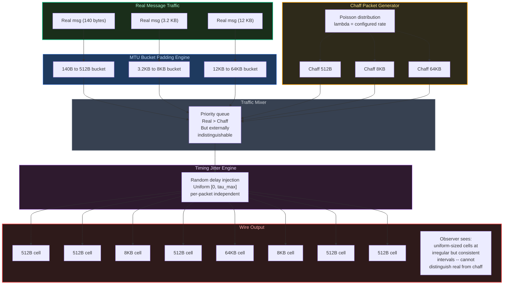
```mermaid
graph TB
    subgraph REAL_TRAFFIC["Real Message Traffic"]
        RT1["Real msg (140 bytes)"]
        RT2["Real msg (3.2 KB)"]
        RT3["Real msg (12 KB)"]
    end

    subgraph PADDING_ENGINE["MTU Bucket Padding Engine"]
        P1["140B to 512B bucket"]
        P2["3.2KB to 8KB bucket"]
        P3["12KB to 64KB bucket"]
    end

    subgraph CHAFF_GENERATOR["Chaff Packet Generator"]
        POISSON["Poisson distribution<br/>lambda = configured rate"]
        CHAFF_512["Chaff 512B"]
        CHAFF_8K["Chaff 8KB"]
        CHAFF_64K["Chaff 64KB"]
    end

    subgraph TIMING["Timing Jitter Engine"]
        JITTER["Random delay injection<br/>Uniform [0, tau_max]<br/>per-packet independent"]
    end

    subgraph MIXER["Traffic Mixer"]
        QUEUE["Priority queue<br/>Real > Chaff<br/>But externally<br/>indistinguishable"]
    end

    subgraph OUTPUT["Wire Output"]
        direction LR
        O1["512B cell"]
        O2["512B cell"]
        O3["8KB cell"]
        O4["512B cell"]
        O5["64KB cell"]
        O6["8KB cell"]
        O7["512B cell"]
        O8["512B cell"]
        NOTE["Observer sees:<br/>uniform-sized cells at<br/>irregular but consistent<br/>intervals -- cannot<br/>distinguish real from chaff"]
    end

    RT1 --> P1
    RT2 --> P2
    RT3 --> P3

    POISSON --> CHAFF_512
    POISSON --> CHAFF_8K
    POISSON --> CHAFF_64K

    P1 --> QUEUE
    P2 --> QUEUE
    P3 --> QUEUE
    CHAFF_512 --> QUEUE
    CHAFF_8K --> QUEUE
    CHAFF_64K --> QUEUE

    QUEUE --> JITTER
    JITTER --> O1
    JITTER --> O2
    JITTER --> O3
    JITTER --> O4
    JITTER --> O5
    JITTER --> O6
    JITTER --> O7
    JITTER --> O8

    style REAL_TRAFFIC fill:#1a2e1a,stroke:#10b981,stroke-width:2px,color:#a7f3d0
    style PADDING_ENGINE fill:#1e3a5f,stroke:#3b82f6,stroke-width:1px,color:#bfdbfe
    style CHAFF_GENERATOR fill:#2e2a1a,stroke:#f59e0b,stroke-width:2px,color:#fde68a
    style TIMING fill:#2e1a2e,stroke:#a855f7,stroke-width:1px,color:#e9d5ff
    style MIXER fill:#374151,stroke:#9ca3af,stroke-width:1px,color:#d1d5db
    style OUTPUT fill:#2e1a1a,stroke:#ef4444,stroke-width:2px,color:#fca5a5
```

---

## 11. Identity and Key Management

How identity keys, prekeys, and credentials are generated, stored, and rotated.

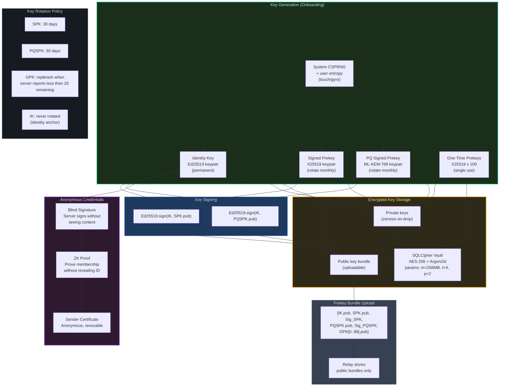
```mermaid
graph TB
    subgraph GENERATION["Key Generation (Onboarding)"]
        ENTROPY["System CSPRNG<br/>+ user entropy<br/>(touch/gyro)"]
        IK["Identity Key<br/>Ed25519 keypair<br/>(permanent)"]
        SPK["Signed Prekey<br/>X25519 keypair<br/>(rotate monthly)"]
        PQSPK["PQ Signed Prekey<br/>ML-KEM-768 keypair<br/>(rotate monthly)"]
        OPK["One-Time Prekeys<br/>X25519 x 100<br/>(single use)"]
    end

    subgraph SIGNING["Key Signing"]
        SIG_SPK["Ed25519.sign(IK, SPK.pub)"]
        SIG_PQSPK["Ed25519.sign(IK, PQSPK.pub)"]
    end

    subgraph CREDENTIALS["Anonymous Credentials"]
        BLIND["Blind Signature<br/>Server signs without<br/>seeing content"]
        ZK["ZK Proof<br/>Prove membership<br/>without revealing ID"]
        CERT["Sender Certificate<br/>Anonymous, revocable"]
    end

    subgraph STORAGE["Encrypted Key Storage"]
        VAULT["SQLCipher Vault<br/>AES-256 + Argon2id<br/>params: m=256MB, t=4, p=2"]
        PRIVATE["Private keys<br/>(zeroize-on-drop)"]
        PUBLIC["Public key bundle<br/>(uploadable)"]
    end

    subgraph UPLOAD["Prekey Bundle Upload"]
        BUNDLE["{IK.pub, SPK.pub, Sig_SPK,<br/>PQSPK.pub, Sig_PQSPK,<br/>OPK[0..99].pub}"]
        RELAY_STORE["Relay stores<br/>public bundles only"]
    end

    subgraph ROTATION["Key Rotation Policy"]
        ROT_SPK["SPK: 30 days"]
        ROT_PQSPK["PQSPK: 30 days"]
        ROT_OPK["OPK: replenish when<br/>server reports less than 20 remaining"]
        ROT_IK["IK: never rotated<br/>(identity anchor)"]
    end

    ENTROPY --> IK
    ENTROPY --> SPK
    ENTROPY --> PQSPK
    ENTROPY --> OPK
    IK --> SIG_SPK
    SPK --> SIG_SPK
    IK --> SIG_PQSPK
    PQSPK --> SIG_PQSPK
    IK --> BLIND
    BLIND --> ZK
    ZK --> CERT
    IK --> PRIVATE
    SPK --> PRIVATE
    PQSPK --> PRIVATE
    OPK --> PRIVATE
    PRIVATE --> VAULT
    IK --> PUBLIC
    SIG_SPK --> PUBLIC
    SIG_PQSPK --> PUBLIC
    OPK --> PUBLIC
    PUBLIC --> BUNDLE
    BUNDLE --> RELAY_STORE

    style GENERATION fill:#1a2e1a,stroke:#10b981,stroke-width:2px,color:#a7f3d0
    style SIGNING fill:#1e3a5f,stroke:#3b82f6,stroke-width:1px,color:#bfdbfe
    style CREDENTIALS fill:#2e1a2e,stroke:#a855f7,stroke-width:2px,color:#e9d5ff
    style STORAGE fill:#2e2a1a,stroke:#f59e0b,stroke-width:2px,color:#fde68a
    style UPLOAD fill:#374151,stroke:#9ca3af,stroke-width:1px,color:#d1d5db
    style ROTATION fill:#161b22,stroke:#6b7280,stroke-width:1px,color:#d1d5db
```

---

## 12. Multi-Device Sesame Synchronization

The Sesame algorithm for maintaining encrypted sessions across devices.

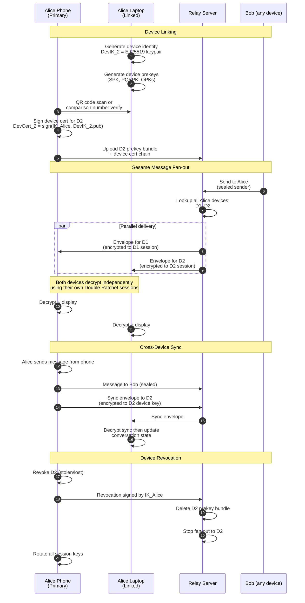
```mermaid
sequenceDiagram
    autonumber
    participant D1 as Alice Phone<br/>(Primary)
    participant D2 as Alice Laptop<br/>(Linked)
    participant S as Relay Server
    participant B as Bob (any device)

    Note over D1,B: Device Linking

    D2->>D2: Generate device identity<br/>DevIK_2 = Ed25519 keypair
    D2->>D2: Generate device prekeys<br/>(SPK, PQSPK, OPKs)
    D1->>D2: QR code scan or<br/>comparison number verify
    D1->>D1: Sign device cert for D2<br/>DevCert_2 = sign(IK_Alice, DevIK_2.pub)
    D1->>S: Upload D2 prekey bundle<br/>+ device cert chain

    Note over D1,B: Sesame Message Fan-out

    B->>S: Send to Alice<br/>(sealed sender)
    S->>S: Lookup all Alice devices:<br/>D1, D2

    par Parallel delivery
        S->>D1: Envelope for D1<br/>(encrypted to D1 session)
        S->>D2: Envelope for D2<br/>(encrypted to D2 session)
    end

    Note over D1,D2: Both devices decrypt independently<br/>using their own Double Ratchet sessions

    D1->>D1: Decrypt + display
    D2->>D2: Decrypt + display

    Note over D1,B: Cross-Device Sync

    D1->>D1: Alice sends message from phone
    D1->>S: Message to Bob (sealed)
    D1->>S: Sync envelope to D2<br/>(encrypted to D2 device key)
    S->>D2: Sync envelope
    D2->>D2: Decrypt sync then update<br/>conversation state

    Note over D1,B: Device Revocation

    D1->>D1: Revoke D2 (stolen/lost)
    D1->>S: Revocation signed by IK_Alice
    S->>S: Delete D2 prekey bundle
    S->>S: Stop fan-out to D2
    D1->>D1: Rotate all session keys
```

---

## 13. Anti-Forensics and Secure Storage

The complete anti-forensics architecture including dual-volume plausible
deniability and emergency wipe.

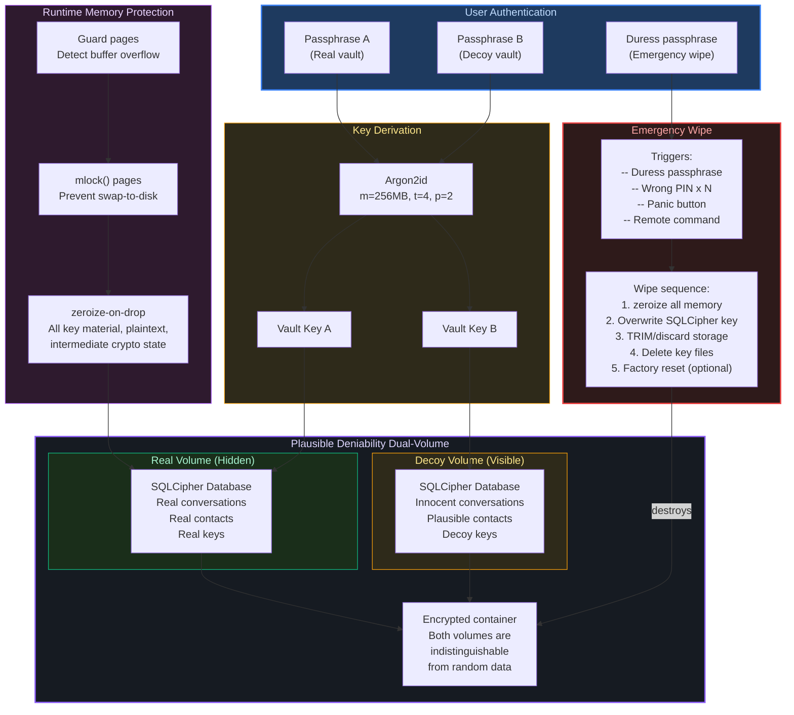
```mermaid
graph TB
    subgraph PASSPHRASE["User Authentication"]
        PASS_A["Passphrase A<br/>(Real vault)"]
        PASS_B["Passphrase B<br/>(Decoy vault)"]
        DURESS["Duress passphrase<br/>(Emergency wipe)"]
    end

    subgraph KDF["Key Derivation"]
        ARGON["Argon2id<br/>m=256MB, t=4, p=2"]
        KEY_A["Vault Key A"]
        KEY_B["Vault Key B"]
    end

    subgraph DUAL_VOLUME["Plausible Deniability Dual-Volume"]
        subgraph VOL_A["Real Volume (Hidden)"]
            DB_A["SQLCipher Database<br/>Real conversations<br/>Real contacts<br/>Real keys"]
        end
        subgraph VOL_B["Decoy Volume (Visible)"]
            DB_B["SQLCipher Database<br/>Innocent conversations<br/>Plausible contacts<br/>Decoy keys"]
        end
        OUTER["Encrypted container<br/>Both volumes are<br/>indistinguishable<br/>from random data"]
    end

    subgraph MEMORY["Runtime Memory Protection"]
        ZEROIZE["zeroize-on-drop<br/>All key material, plaintext,<br/>intermediate crypto state"]
        MLOCK["mlock() pages<br/>Prevent swap-to-disk"]
        GUARD_PAGE["Guard pages<br/>Detect buffer overflow"]
    end

    subgraph WIPE["Emergency Wipe"]
        TRIGGER["Triggers:<br/>-- Duress passphrase<br/>-- Wrong PIN x N<br/>-- Panic button<br/>-- Remote command"]
        WIPE_SEQ["Wipe sequence:<br/>1. zeroize all memory<br/>2. Overwrite SQLCipher key<br/>3. TRIM/discard storage<br/>4. Delete key files<br/>5. Factory reset (optional)"]
    end

    PASS_A --> ARGON
    PASS_B --> ARGON
    ARGON --> KEY_A
    ARGON --> KEY_B
    KEY_A --> DB_A
    KEY_B --> DB_B
    DB_A --> OUTER
    DB_B --> OUTER

    ZEROIZE --> DB_A
    MLOCK --> ZEROIZE
    GUARD_PAGE --> MLOCK

    DURESS --> TRIGGER
    TRIGGER --> WIPE_SEQ
    WIPE_SEQ -->|"destroys"| OUTER

    style PASSPHRASE fill:#1e3a5f,stroke:#3b82f6,stroke-width:2px,color:#bfdbfe
    style KDF fill:#2e2a1a,stroke:#f59e0b,stroke-width:1px,color:#fde68a
    style DUAL_VOLUME fill:#161b22,stroke:#8b5cf6,stroke-width:2px,color:#ddd6fe
    style VOL_A fill:#1a2e1a,stroke:#10b981,stroke-width:1px,color:#a7f3d0
    style VOL_B fill:#2e2a1a,stroke:#f59e0b,stroke-width:1px,color:#fde68a
    style MEMORY fill:#2e1a2e,stroke:#a855f7,stroke-width:1px,color:#e9d5ff
    style WIPE fill:#2e1a1a,stroke:#ef4444,stroke-width:2px,color:#fca5a5
```

---

## 14. Sovereign Infrastructure Deployment

The complete self-hosted relay server stack.

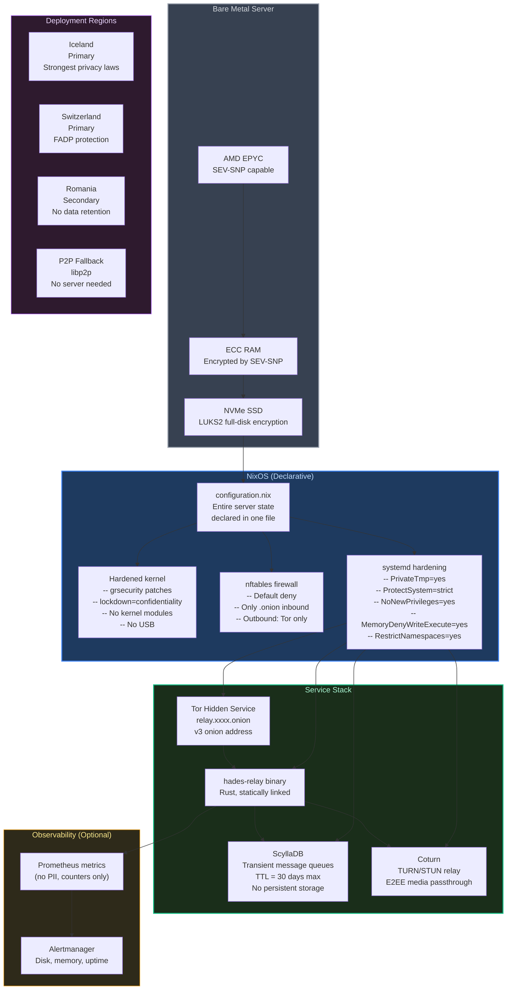
```mermaid
graph TB
    subgraph HARDWARE["Bare Metal Server"]
        CPU["AMD EPYC<br/>SEV-SNP capable"]
        RAM["ECC RAM<br/>Encrypted by SEV-SNP"]
        DISK["NVMe SSD<br/>LUKS2 full-disk encryption"]
    end

    subgraph NIXOS["NixOS (Declarative)"]
        NIX_CONFIG["configuration.nix<br/>Entire server state<br/>declared in one file"]
        KERNEL["Hardened kernel<br/>-- grsecurity patches<br/>-- lockdown=confidentiality<br/>-- No kernel modules<br/>-- No USB"]
        FIREWALL["nftables firewall<br/>-- Default deny<br/>-- Only .onion inbound<br/>-- Outbound: Tor only"]
        SYSTEMD["systemd hardening<br/>-- PrivateTmp=yes<br/>-- ProtectSystem=strict<br/>-- NoNewPrivileges=yes<br/>-- MemoryDenyWriteExecute=yes<br/>-- RestrictNamespaces=yes"]
    end

    subgraph SERVICES["Service Stack"]
        TOR_HS["Tor Hidden Service<br/>relay.xxxx.onion<br/>v3 onion address"]
        RELAY_BIN["hades-relay binary<br/>Rust, statically linked"]
        SCYLLA["ScyllaDB<br/>Transient message queues<br/>TTL = 30 days max<br/>No persistent storage"]
        COTURN_SVC["Coturn<br/>TURN/STUN relay<br/>E2EE media passthrough"]
    end

    subgraph MONITORING["Observability (Optional)"]
        METRICS["Prometheus metrics<br/>(no PII, counters only)"]
        ALERTS["Alertmanager<br/>Disk, memory, uptime"]
    end

    subgraph REGIONS["Deployment Regions"]
        R_IS["Iceland<br/>Primary<br/>Strongest privacy laws"]
        R_CH["Switzerland<br/>Primary<br/>FADP protection"]
        R_RO["Romania<br/>Secondary<br/>No data retention"]
        R_P2P["P2P Fallback<br/>libp2p<br/>No server needed"]
    end

    CPU --> RAM
    RAM --> DISK
    DISK --> NIX_CONFIG
    NIX_CONFIG --> KERNEL
    NIX_CONFIG --> FIREWALL
    NIX_CONFIG --> SYSTEMD

    SYSTEMD --> TOR_HS
    SYSTEMD --> RELAY_BIN
    SYSTEMD --> SCYLLA
    SYSTEMD --> COTURN_SVC

    TOR_HS --> RELAY_BIN
    RELAY_BIN --> SCYLLA
    RELAY_BIN --> COTURN_SVC
    RELAY_BIN --> METRICS
    METRICS --> ALERTS

    style HARDWARE fill:#374151,stroke:#9ca3af,stroke-width:2px,color:#d1d5db
    style NIXOS fill:#1e3a5f,stroke:#3b82f6,stroke-width:2px,color:#bfdbfe
    style SERVICES fill:#1a2e1a,stroke:#10b981,stroke-width:2px,color:#a7f3d0
    style MONITORING fill:#2e2a1a,stroke:#f59e0b,stroke-width:1px,color:#fde68a
    style REGIONS fill:#2e1a2e,stroke:#a855f7,stroke-width:1px,color:#e9d5ff
```

---

## 15. Connection State Machine

The 8-stage secure connection establishment displayed in the
`SecureRouteIndicator` HUD.

```mermaid
stateDiagram-v2
    [*] --> DISCONNECTED

    DISCONNECTED --> BOOTSTRAPPING: User opens app

    state BOOTSTRAPPING {
        [*] --> LOADING_KEYS
        LOADING_KEYS --> KEYS_LOADED: SQLCipher decrypted
        KEYS_LOADED --> [*]
    }

    BOOTSTRAPPING --> TOR_CONNECTING: Keys loaded

    state TOR_CONNECTING {
        [*] --> FETCHING_CONSENSUS
        FETCHING_CONSENSUS --> CONSENSUS_OK: Directory fetched
        CONSENSUS_OK --> SELECTING_GUARD
        SELECTING_GUARD --> GUARD_SELECTED: Vanguards-v2 policy
        GUARD_SELECTED --> [*]
    }

    TOR_CONNECTING --> CIRCUIT_BUILDING: Guard selected

    state CIRCUIT_BUILDING {
        [*] --> HOP_1_GUARD
        HOP_1_GUARD --> HOP_2_MIDDLE: TLS + onion layer
        HOP_2_MIDDLE --> HOP_3_EXIT: Extend circuit
        HOP_3_EXIT --> CIRCUIT_READY
        CIRCUIT_READY --> [*]
    }

    CIRCUIT_BUILDING --> RELAY_HANDSHAKE: Circuit ready

    state RELAY_HANDSHAKE {
        [*] --> ONION_CONNECT
        ONION_CONNECT --> WS_UPGRADE: .onion resolved
        WS_UPGRADE --> WS_OPEN: WebSocket opened
        WS_OPEN --> [*]
    }

    RELAY_HANDSHAKE --> AUTHENTICATING: WebSocket open

    state AUTHENTICATING {
        [*] --> SEND_ZK_PROOF
        SEND_ZK_PROOF --> VERIFY_BLIND_SIG: ZK proof sent
        VERIFY_BLIND_SIG --> AUTH_OK: Credential accepted
        AUTH_OK --> [*]
    }

    AUTHENTICATING --> SYNCING: Authenticated

    state SYNCING {
        [*] --> FETCH_QUEUED_MSGS
        FETCH_QUEUED_MSGS --> FETCH_PREKEYS: Messages synced
        FETCH_PREKEYS --> REPLENISH_OPK: If OPK count low
        REPLENISH_OPK --> SYNC_DONE
        FETCH_PREKEYS --> SYNC_DONE: OPK count OK
        SYNC_DONE --> [*]
    }

    SYNCING --> COVER_TRAFFIC_INIT: Synced

    state COVER_TRAFFIC_INIT {
        [*] --> START_CHAFF
        START_CHAFF --> CHAFF_RUNNING: Poisson timer started
        CHAFF_RUNNING --> [*]
    }

    COVER_TRAFFIC_INIT --> CONNECTED: Fully operational

    CONNECTED --> RECONNECTING: Connection lost
    RECONNECTING --> TOR_CONNECTING: Rebuild circuit
    CONNECTED --> DISCONNECTED: User locks app

    note right of CONNECTED
        Stage 8/8: All systems operational
        Tor circuit active
        Cover traffic flowing
        Message queue drained
    end note
```

---

## 16. Message Delivery State Machine

The five delivery states rendered by `MessageStatus.tsx`.

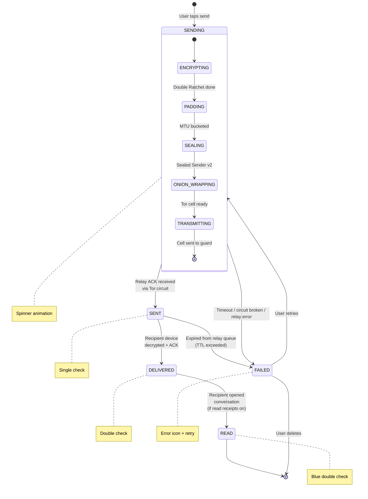
```mermaid
stateDiagram-v2
    [*] --> SENDING: User taps send

    SENDING --> SENT: Relay ACK received<br/>via Tor circuit
    SENDING --> FAILED: Timeout / circuit broken / relay error

    SENT --> DELIVERED: Recipient device<br/>decrypted + ACK
    SENT --> FAILED: Expired from relay queue<br/>(TTL exceeded)

    DELIVERED --> READ: Recipient opened<br/>conversation<br/>(if read receipts on)

    FAILED --> SENDING: User retries

    READ --> [*]
    FAILED --> [*]: User deletes

    state SENDING {
        [*] --> ENCRYPTING
        ENCRYPTING --> PADDING: Double Ratchet done
        PADDING --> SEALING: MTU bucketed
        SEALING --> ONION_WRAPPING: Sealed Sender v2
        ONION_WRAPPING --> TRANSMITTING: Tor cell ready
        TRANSMITTING --> [*]: Cell sent to guard
    }

    note right of SENDING: Spinner animation
    note right of SENT: Single check
    note right of DELIVERED: Double check
    note right of READ: Blue double check
    note right of FAILED: Error icon + retry
```

---

## 17. Pluggable Transport Selection

Decision tree for choosing the right transport based on network conditions.

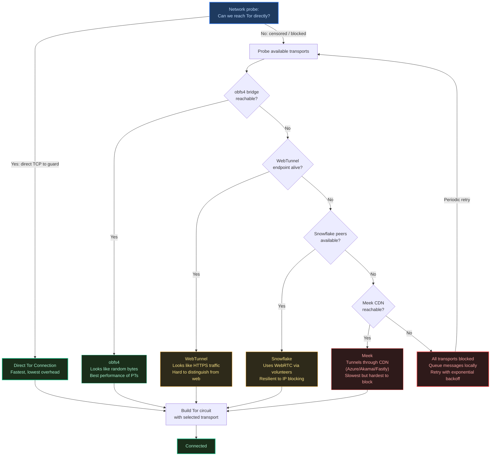
```mermaid
flowchart TD
    START["Network probe:<br/>Can we reach Tor directly?"]

    START -->|"Yes: direct TCP to guard"| DIRECT["Direct Tor Connection<br/>Fastest, lowest overhead"]

    START -->|"No: censored / blocked"| PROBE["Probe available transports"]

    PROBE --> CHECK_OBFS4{"obfs4 bridge<br/>reachable?"}
    CHECK_OBFS4 -->|"Yes"| OBFS4["obfs4<br/>Looks like random bytes<br/>Best performance of PTs"]

    CHECK_OBFS4 -->|"No"| CHECK_WT{"WebTunnel<br/>endpoint alive?"}
    CHECK_WT -->|"Yes"| WEBTUNNEL["WebTunnel<br/>Looks like HTTPS traffic<br/>Hard to distinguish from web"]

    CHECK_WT -->|"No"| CHECK_SNOW{"Snowflake peers<br/>available?"}
    CHECK_SNOW -->|"Yes"| SNOWFLAKE["Snowflake<br/>Uses WebRTC via volunteers<br/>Resilient to IP blocking"]

    CHECK_SNOW -->|"No"| CHECK_MEEK{"Meek CDN<br/>reachable?"}
    CHECK_MEEK -->|"Yes"| MEEK["Meek<br/>Tunnels through CDN<br/>(Azure/Akamai/Fastly)<br/>Slowest but hardest to block"]

    CHECK_MEEK -->|"No"| FAIL["All transports blocked<br/>Queue messages locally<br/>Retry with exponential backoff"]

    DIRECT --> CIRCUIT["Build Tor circuit<br/>with selected transport"]
    OBFS4 --> CIRCUIT
    WEBTUNNEL --> CIRCUIT
    SNOWFLAKE --> CIRCUIT
    MEEK --> CIRCUIT

    FAIL -->|"Periodic retry"| PROBE

    CIRCUIT --> CONNECTED["Connected"]

    style START fill:#1e3a5f,stroke:#3b82f6,stroke-width:2px,color:#bfdbfe
    style DIRECT fill:#1a2e1a,stroke:#10b981,stroke-width:2px,color:#a7f3d0
    style OBFS4 fill:#1a2e1a,stroke:#10b981,stroke-width:1px,color:#a7f3d0
    style WEBTUNNEL fill:#2e2a1a,stroke:#f59e0b,stroke-width:1px,color:#fde68a
    style SNOWFLAKE fill:#2e2a1a,stroke:#f59e0b,stroke-width:1px,color:#fde68a
    style MEEK fill:#2e1a1a,stroke:#ef4444,stroke-width:1px,color:#fca5a5
    style FAIL fill:#2e1a1a,stroke:#ef4444,stroke-width:2px,color:#fca5a5
    style CONNECTED fill:#1a2e1a,stroke:#10b981,stroke-width:2px,color:#a7f3d0
```

---

## 18. Bridge Auto-Rotation Lifecycle

How bridge addresses are obtained, rotated, and distributed.

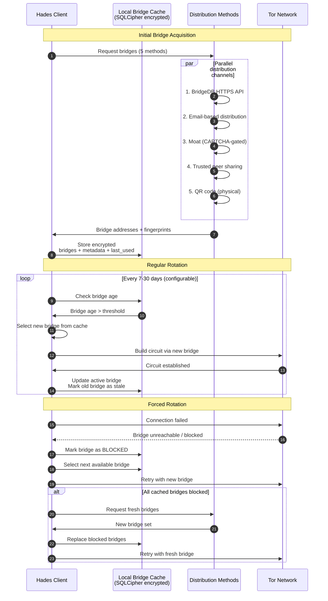
```mermaid
sequenceDiagram
    autonumber
    participant CLIENT as Hades Client
    participant CACHE as Local Bridge Cache<br/>(SQLCipher encrypted)
    participant METHODS as Distribution Methods
    participant TOR as Tor Network

    Note over CLIENT,TOR: Initial Bridge Acquisition

    CLIENT->>METHODS: Request bridges (5 methods)

    par Parallel distribution channels
        METHODS->>METHODS: 1. BridgeDB HTTPS API
        METHODS->>METHODS: 2. Email-based distribution
        METHODS->>METHODS: 3. Moat (CAPTCHA-gated)
        METHODS->>METHODS: 4. Trusted peer sharing
        METHODS->>METHODS: 5. QR code (physical)
    end

    METHODS->>CLIENT: Bridge addresses + fingerprints
    CLIENT->>CACHE: Store encrypted<br/>bridges + metadata + last_used

    Note over CLIENT,TOR: Regular Rotation

    loop Every 7-30 days (configurable)
        CLIENT->>CACHE: Check bridge age
        CACHE->>CLIENT: Bridge age > threshold

        CLIENT->>CLIENT: Select new bridge from cache
        CLIENT->>TOR: Build circuit via new bridge
        TOR->>CLIENT: Circuit established

        CLIENT->>CACHE: Update active bridge<br/>Mark old bridge as stale
    end

    Note over CLIENT,TOR: Forced Rotation

    CLIENT->>TOR: Connection failed
    TOR-->>CLIENT: Bridge unreachable / blocked

    CLIENT->>CACHE: Mark bridge as BLOCKED
    CLIENT->>CACHE: Select next available bridge
    CLIENT->>TOR: Retry with new bridge

    alt All cached bridges blocked
        CLIENT->>METHODS: Request fresh bridges
        METHODS->>CLIENT: New bridge set
        CLIENT->>CACHE: Replace blocked bridges
        CLIENT->>TOR: Retry with fresh bridge
    end
```

---

## 19. Emergency Wipe Sequence

Step-by-step execution of the emergency data destruction process.

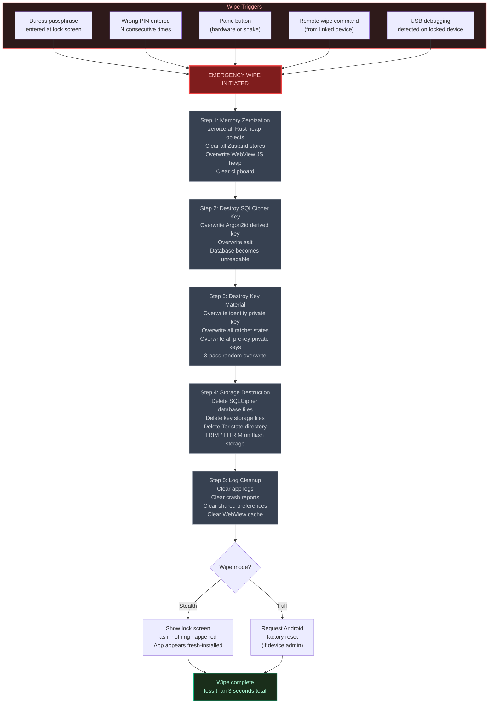
```mermaid
flowchart TB
    subgraph TRIGGERS["Wipe Triggers"]
        T1["Duress passphrase<br/>entered at lock screen"]
        T2["Wrong PIN entered<br/>N consecutive times"]
        T3["Panic button<br/>(hardware or shake)"]
        T4["Remote wipe command<br/>(from linked device)"]
        T5["USB debugging<br/>detected on locked device"]
    end

    T1 --> WIPE_START
    T2 --> WIPE_START
    T3 --> WIPE_START
    T4 --> WIPE_START
    T5 --> WIPE_START

    WIPE_START["EMERGENCY WIPE INITIATED"]

    WIPE_START --> STEP1["Step 1: Memory Zeroization<br/>zeroize all Rust heap objects<br/>Clear all Zustand stores<br/>Overwrite WebView JS heap<br/>Clear clipboard"]

    STEP1 --> STEP2["Step 2: Destroy SQLCipher Key<br/>Overwrite Argon2id derived key<br/>Overwrite salt<br/>Database becomes unreadable"]

    STEP2 --> STEP3["Step 3: Destroy Key Material<br/>Overwrite identity private key<br/>Overwrite all ratchet states<br/>Overwrite all prekey private keys<br/>3-pass random overwrite"]

    STEP3 --> STEP4["Step 4: Storage Destruction<br/>Delete SQLCipher database files<br/>Delete key storage files<br/>Delete Tor state directory<br/>TRIM / FITRIM on flash storage"]

    STEP4 --> STEP5["Step 5: Log Cleanup<br/>Clear app logs<br/>Clear crash reports<br/>Clear shared preferences<br/>Clear WebView cache"]

    STEP5 --> STEP6{"Wipe mode?"}

    STEP6 -->|"Stealth"| STEALTH["Show lock screen<br/>as if nothing happened<br/>App appears fresh-installed"]

    STEP6 -->|"Full"| FACTORY["Request Android<br/>factory reset<br/>(if device admin)"]

    STEALTH --> DONE["Wipe complete<br/>less than 3 seconds total"]
    FACTORY --> DONE

    style TRIGGERS fill:#2e1a1a,stroke:#ef4444,stroke-width:2px,color:#fca5a5
    style WIPE_START fill:#7f1d1d,stroke:#ef4444,stroke-width:3px,color:#fecaca
    style STEP1 fill:#374151,stroke:#9ca3af,stroke-width:1px,color:#d1d5db
    style STEP2 fill:#374151,stroke:#9ca3af,stroke-width:1px,color:#d1d5db
    style STEP3 fill:#374151,stroke:#9ca3af,stroke-width:1px,color:#d1d5db
    style STEP4 fill:#374151,stroke:#9ca3af,stroke-width:1px,color:#d1d5db
    style STEP5 fill:#374151,stroke:#9ca3af,stroke-width:1px,color:#d1d5db
    style DONE fill:#1a2e1a,stroke:#10b981,stroke-width:2px,color:#a7f3d0
```

---

## 20. CI/CD Release Pipeline

The complete GitHub Actions pipeline from commit to verified release.

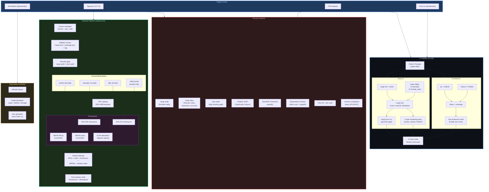
```mermaid
flowchart TB
    subgraph TRIGGER["Trigger Events"]
        PUSH["Push to main/develop"]
        PR["Pull Request"]
        TAG["Tag push (vX.Y.Z)"]
        SCHEDULE["Scheduled (daily/weekly)"]
    end

    subgraph CI_PIPELINE["CI Pipeline (ci.yml)"]
        direction TB
        CHANGES["Detect Changes<br/>(paths-filter)"]
        subgraph RUST_CI["Rust CI"]
            RFMT["cargo fmt --check"]
            RCLIP["cargo clippy<br/>-D warnings<br/>-D unwrap_used"]
            RTEST["cargo test<br/>(Linux, macOS, Windows)"]
            RCOV["cargo llvm-cov<br/>(gte 60% gate)"]
            RCRYPTO["Crypto hardening tests<br/>zeroize, ratchet, PQXDH"]
        end
        subgraph FRONT_CI["Frontend CI"]
            FTSC["tsc --noEmit"]
            FLINT["ESLint + Prettier"]
            FTEST["Vitest + coverage"]
            FBUILD["Vite production build<br/>Bundle size check"]
        end
        GATE["CI Pass Gate<br/>All jobs must pass"]
    end

    subgraph SECURITY_PIPELINE["Security Pipeline"]
        AUDIT["cargo audit<br/>(RustSec daily)"]
        DENY["cargo deny<br/>(licenses, bans,<br/>advisories, sources)"]
        NPM_AUDIT["npm audit<br/>(high severity gate)"]
        CODEQL["CodeQL SAST<br/>(TypeScript, Actions)"]
        SCORECARD["OpenSSF Scorecard<br/>(weekly)"]
        DEP_REVIEW["Dependency Review<br/>(block vuln + copyleft)"]
        TRIVY["Trivy FS + IaC scan"]
        LICENSE["License compliance<br/>(deny GPL/AGPL)"]
    end

    subgraph RELEASE_PIPELINE["Release Pipeline (release.yml)"]
        direction TB
        META["Extract metadata<br/>Version + tag + date"]
        VALIDATE["Validate version<br/>Cargo.toml = package.json = tag"]
        SEC_GATE["Security gate<br/>cargo audit + npm audit"]
        subgraph BUILD["Android Build Matrix"]
            B_ARM64["arm64-v8a build"]
            B_ARM7["armeabi-v7a build"]
            B_X86["x86_64 build"]
            B_AAB["AAB bundle<br/>(arm64 only)"]
        end
        SIGN["APK signing<br/>RSA-4096 keystore"]
        subgraph PROVENANCE["Provenance"]
            SHA256["SHA-256 checksums"]
            SHA512["SHA-512 checksums"]
            SBOM_R["SBOM (Rust)<br/>CycloneDX"]
            SBOM_N["SBOM (npm)<br/>CycloneDX"]
            ATTEST["SLSA attestation<br/>Sigstore signing"]
        end
        RELEASE["GitHub Release<br/>APKs + AAB + checksums +<br/>SBOMs + release notes"]
        VERIFY["Post-release verify<br/>Checksums + attestations"]
    end

    subgraph DEPENDABOT["Dependabot (weekly)"]
        DEP_ACTIONS["GitHub Actions"]
        DEP_CARGO["Cargo (grouped:<br/>crypto, network, storage)"]
        DEP_NPM["npm (grouped:<br/>react, build, ui)"]
    end

    PUSH --> CI_PIPELINE
    PR --> CI_PIPELINE
    PR --> DEP_REVIEW
    TAG --> RELEASE_PIPELINE
    SCHEDULE --> SECURITY_PIPELINE
    SCHEDULE --> DEPENDABOT

    CHANGES --> RUST_CI
    CHANGES --> FRONT_CI
    RFMT --> RTEST
    RCLIP --> RTEST
    RTEST --> RCOV
    RTEST --> RCRYPTO
    FTSC --> FTEST
    FLINT --> FTEST
    FTEST --> FBUILD
    RCOV --> GATE
    RCRYPTO --> GATE
    FBUILD --> GATE

    META --> VALIDATE
    VALIDATE --> SEC_GATE
    SEC_GATE --> BUILD
    B_ARM64 --> SIGN
    B_ARM7 --> SIGN
    B_X86 --> SIGN
    B_AAB --> SIGN
    SIGN --> SHA256
    SIGN --> SHA512
    SHA256 --> ATTEST
    SHA512 --> ATTEST
    SBOM_R --> RELEASE
    SBOM_N --> RELEASE
    ATTEST --> RELEASE
    RELEASE --> VERIFY

    style TRIGGER fill:#1e3a5f,stroke:#3b82f6,stroke-width:2px,color:#bfdbfe
    style CI_PIPELINE fill:#0d1117,stroke:#58a6ff,stroke-width:2px,color:#c9d1d9
    style SECURITY_PIPELINE fill:#2e1a1a,stroke:#ef4444,stroke-width:2px,color:#fca5a5
    style RELEASE_PIPELINE fill:#1a2e1a,stroke:#10b981,stroke-width:2px,color:#a7f3d0
    style DEPENDABOT fill:#2e2a1a,stroke:#f59e0b,stroke-width:1px,color:#fde68a
    style PROVENANCE fill:#2e1a2e,stroke:#a855f7,stroke-width:1px,color:#e9d5ff
```

---

## 21. Threat Model Adversary Classes

The six adversary classes and the mitigations that defend against each.

```mermaid
graph TB
    subgraph ADVERSARIES["Adversary Classes"]
        direction TB
        A1["Global Passive Adversary (GPA)<br/>Nation-state level traffic monitoring<br/>Sees all network flows"]
        A2["Active Network Adversary<br/>Can inject, modify, drop packets<br/>MitM capability"]
        A3["Server Compromise<br/>Full access to relay server<br/>RAM, disk, process"]
        A4["Endpoint Compromise<br/>Malware on user device<br/>Physical access to device"]
        A5["Quantum Adversary<br/>Future CRQC capability<br/>Harvest-now-decrypt-later"]
        A6["Legal Coercion<br/>Court orders, subpoenas<br/>National security letters"]
    end

    subgraph MITIGATIONS["Mitigation Matrix"]
        direction TB
        M_TOR["Tor forced routing<br/>+ Vanguards-v2"]
        M_COVER["Cover traffic<br/>Poisson chaff + jitter"]
        M_PAD["MTU bucketing<br/>512B / 8KB / 64KB"]
        M_PT["Pluggable transports<br/>obfs4, WebTunnel,<br/>Snowflake, Meek"]
        M_E2EE["End-to-end encryption<br/>Double Ratchet"]
        M_SEALED["Sealed Sender v2<br/>Double-sealed envelopes"]
        M_ZK["Zero-knowledge server<br/>No metadata stored"]
        M_SEV["AMD SEV-SNP<br/>RAM encryption (planned)"]
        M_SQLC["SQLCipher + Argon2id<br/>Local encrypted storage"]
        M_ZERO["Zeroize-on-drop<br/>Memory protection"]
        M_WIPE["Emergency wipe<br/>Duress passphrase"]
        M_DENY["Plausible deniability<br/>Dual-volume"]
        M_PQXDH["PQXDH key exchange<br/>X25519 + ML-KEM-768"]
        M_SPQR["SPQR ratchet<br/>Periodic PQ injection"]
        M_REPRO["Reproducible builds"]
        M_CANARY["Warrant canary (planned)"]
        M_PIR["SimplePIR contact<br/>discovery (planned)"]
    end

    A1 --> M_TOR
    A1 --> M_COVER
    A1 --> M_PAD
    A1 --> M_PT
    A1 --> M_PIR

    A2 --> M_E2EE
    A2 --> M_TOR
    A2 --> M_PT

    A3 --> M_E2EE
    A3 --> M_SEALED
    A3 --> M_ZK
    A3 --> M_SEV

    A4 --> M_SQLC
    A4 --> M_ZERO
    A4 --> M_WIPE
    A4 --> M_DENY

    A5 --> M_PQXDH
    A5 --> M_SPQR

    A6 --> M_ZK
    A6 --> M_REPRO
    A6 --> M_CANARY
    A6 --> M_DENY

    style ADVERSARIES fill:#2e1a1a,stroke:#ef4444,stroke-width:2px,color:#fca5a5
    style MITIGATIONS fill:#1a2e1a,stroke:#10b981,stroke-width:2px,color:#a7f3d0
```

---

## 22. Data Flow Classification

What data exists at each system boundary and what an adversary at that
boundary can learn.

```mermaid
graph LR
    subgraph APP["Application Layer"]
        PLAIN["[OK] Plaintext message<br/>[OK] Sender identity<br/>[OK] Recipient identity<br/>[OK] Timestamps<br/>[OK] Conversation history"]
    end

    subgraph CRYPTO_LAYER["Encryption Layer"]
        ENC["[X] Plaintext<br/>[X] Sender (inner sealed)<br/>[X] Recipient (outer sealed)<br/>[OK] Ciphertext blob<br/>[OK] Envelope size class"]
    end

    subgraph TOR_LAYER["Tor Layer"]
        TOR_DATA["[X] Plaintext<br/>[X] Sender<br/>[X] Recipient<br/>[X] Ciphertext<br/>[OK] Onion cell<br/>[OK] Cell size (fixed)<br/>[OK] Timing (jittered)"]
    end

    subgraph WIRE["Network Wire"]
        WIRE_DATA["[X] Plaintext<br/>[X] Sender<br/>[X] Recipient<br/>[X] Content type<br/>[OK] TLS-wrapped bytes<br/>[OK] Source IP (guard sees)<br/>[OK] Destination IP<br/>[OK] Timing (jittered + chaff)"]
    end

    subgraph SERVER_LAYER["Relay Server"]
        SRV_DATA["[X] Plaintext<br/>[X] Sender identity<br/>[OK] Recipient mailbox<br/>  (outer seal only)<br/>[X] Message content<br/>[X] Social graph<br/>  (sealed sender)"]
    end

    subgraph LOCAL_STORE["Local Storage"]
        STORE_DATA["[OK] All data (encrypted)<br/>Requires passphrase<br/>  + Argon2id KDF<br/>Dual-volume<br/>  deniability"]
    end

    APP -->|"Double Ratchet +<br/>Sealed Sender v2"| CRYPTO_LAYER
    CRYPTO_LAYER -->|"Onion<br/>encryption"| TOR_LAYER
    TOR_LAYER -->|"TLS to<br/>guard"| WIRE
    WIRE -->|"3-hop<br/>circuit"| SERVER_LAYER
    APP -->|"SQLCipher<br/>AES-256"| LOCAL_STORE

    style APP fill:#1a2e1a,stroke:#10b981,stroke-width:2px,color:#a7f3d0
    style CRYPTO_LAYER fill:#1e3a5f,stroke:#3b82f6,stroke-width:2px,color:#bfdbfe
    style TOR_LAYER fill:#2e1a2e,stroke:#a855f7,stroke-width:2px,color:#e9d5ff
    style WIRE fill:#374151,stroke:#9ca3af,stroke-width:2px,color:#d1d5db
    style SERVER_LAYER fill:#2e2a1a,stroke:#f59e0b,stroke-width:2px,color:#fde68a
    style LOCAL_STORE fill:#2e1a1a,stroke:#ef4444,stroke-width:2px,color:#fca5a5
```

---

## 23. Key Hierarchy

The complete derivation tree from user passphrase to every cryptographic
key in the system.

```mermaid
graph TB
    subgraph ROOT["User Secrets"]
        PASS["User Passphrase"]
        ENTROPY["Device CSPRNG<br/>+ User Entropy"]
    end

    PASS --> ARGON["Argon2id<br/>m=256MB, t=4, p=2<br/>salt = random 32B"]

    ARGON --> VAULT_KEY["Vault Master Key<br/>(256-bit)"]

    VAULT_KEY --> SQLCIPHER_KEY["SQLCipher Database Key<br/>AES-256-CBC"]

    ENTROPY --> IK_PRIV["Identity Private Key<br/>Ed25519"]
    IK_PRIV --> IK_PUB["Identity Public Key"]

    ENTROPY --> SPK_PRIV["Signed Prekey Private<br/>X25519"]
    SPK_PRIV --> SPK_PUB["Signed Prekey Public"]
    IK_PRIV -->|"Ed25519.sign"| SPK_SIG["SPK Signature"]

    ENTROPY --> PQSPK_PRIV["PQ Signed Prekey Private<br/>ML-KEM-768 dk"]
    PQSPK_PRIV --> PQSPK_PUB["PQ Signed Prekey Public<br/>ML-KEM-768 ek"]
    IK_PRIV -->|"Ed25519.sign"| PQSPK_SIG["PQSPK Signature"]

    ENTROPY --> OPK_PRIV["One-Time Prekeys Private<br/>X25519 x 100"]
    OPK_PRIV --> OPK_PUB["One-Time Prekeys Public"]

    subgraph PQXDH_DERIVE["PQXDH Key Agreement"]
        DH1["DH1: IK_A x SPK_B"]
        DH2["DH2: EK_A x IK_B"]
        DH3["DH3: EK_A x SPK_B"]
        DH4["DH4: EK_A x OPK_B"]
        PQ_SS["ML-KEM shared secret"]
        HKDF_INIT["HKDF-SHA256<br/>ikm = DH1 | DH2 | DH3 | DH4 | PQ_SS"]
    end

    IK_PRIV --> DH1
    SPK_PRIV --> DH1
    ENTROPY -->|"ephemeral"| DH2
    DH2 --> DH3
    DH3 --> DH4
    PQSPK_PUB --> PQ_SS
    DH1 --> HKDF_INIT
    DH2 --> HKDF_INIT
    DH3 --> HKDF_INIT
    DH4 --> HKDF_INIT
    PQ_SS --> HKDF_INIT

    HKDF_INIT --> SK["Session Root Key<br/>(256-bit)"]

    subgraph RATCHET["Double Ratchet Derivation"]
        SK --> RK["Root Key Chain<br/>RK0 to RK1 to RK2 ..."]
        RK -->|"HKDF"| CK["Chain Key<br/>CK0 to CK1 to CK2 ..."]
        CK -->|"HMAC 0x01"| MK["Message Key<br/>(per-message, ephemeral)"]
        CK -->|"HMAC 0x02"| CK_NEXT["Next Chain Key"]
    end

    MK --> CHACHA["ChaCha20-Poly1305<br/>Encrypt/Decrypt message"]

    subgraph SEALED_KEYS["Sealed Sender Keys"]
        ENTROPY -->|"ephemeral"| SEAL_EPH["Seal Ephemeral Key<br/>X25519"]
        SEAL_EPH --> INNER_KEY["Inner Seal Key<br/>HKDF(DH(eph, recipient))"]
        SEAL_EPH --> OUTER_KEY["Outer Seal Key<br/>HKDF(DH(eph, relay))"]
    end

    subgraph DEVICE_KEYS["Per-Device Keys"]
        ENTROPY --> DEV_IK["Device Identity Key<br/>Ed25519"]
        IK_PRIV -->|"sign"| DEV_CERT["Device Certificate"]
        DEV_IK --> DEV_SPK["Device Signed Prekey"]
        DEV_IK --> DEV_OPK["Device One-Time Prekeys"]
    end

    SQLCIPHER_KEY -->|"encrypts"| STORE["All keys stored in<br/>SQLCipher vault"]
    IK_PRIV --> STORE
    SPK_PRIV --> STORE
    PQSPK_PRIV --> STORE
    OPK_PRIV --> STORE
    DEV_IK --> STORE

    style ROOT fill:#1e3a5f,stroke:#3b82f6,stroke-width:2px,color:#bfdbfe
    style PQXDH_DERIVE fill:#2e1a2e,stroke:#a855f7,stroke-width:2px,color:#e9d5ff
    style RATCHET fill:#2e2a1a,stroke:#f59e0b,stroke-width:2px,color:#fde68a
    style SEALED_KEYS fill:#1a2e1a,stroke:#10b981,stroke-width:1px,color:#a7f3d0
    style DEVICE_KEYS fill:#374151,stroke:#9ca3af,stroke-width:1px,color:#d1d5db
```

---

## License

This architecture documentation is part of the Hades Messaging project and is
licensed under the **MIT License**. See [LICENSE](../LICENSE).
