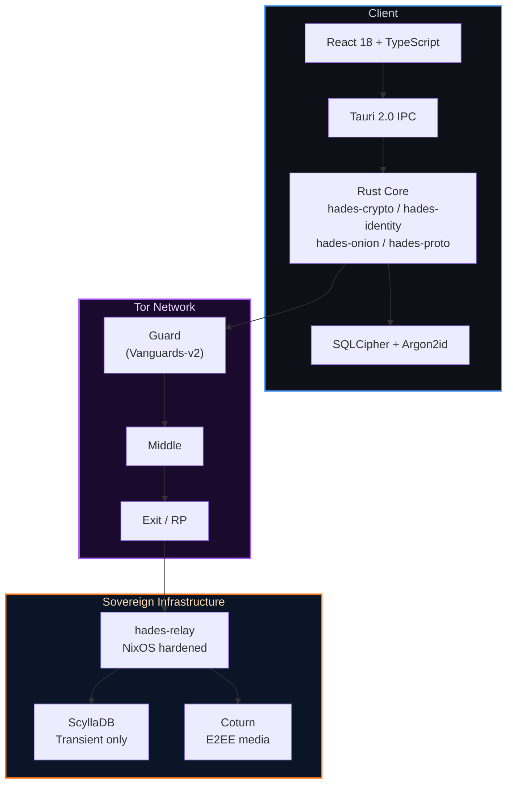
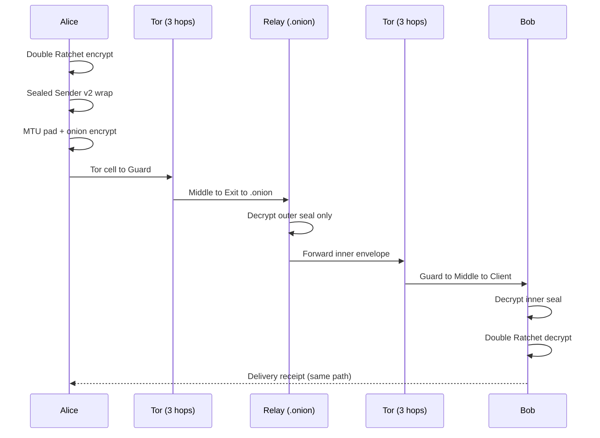
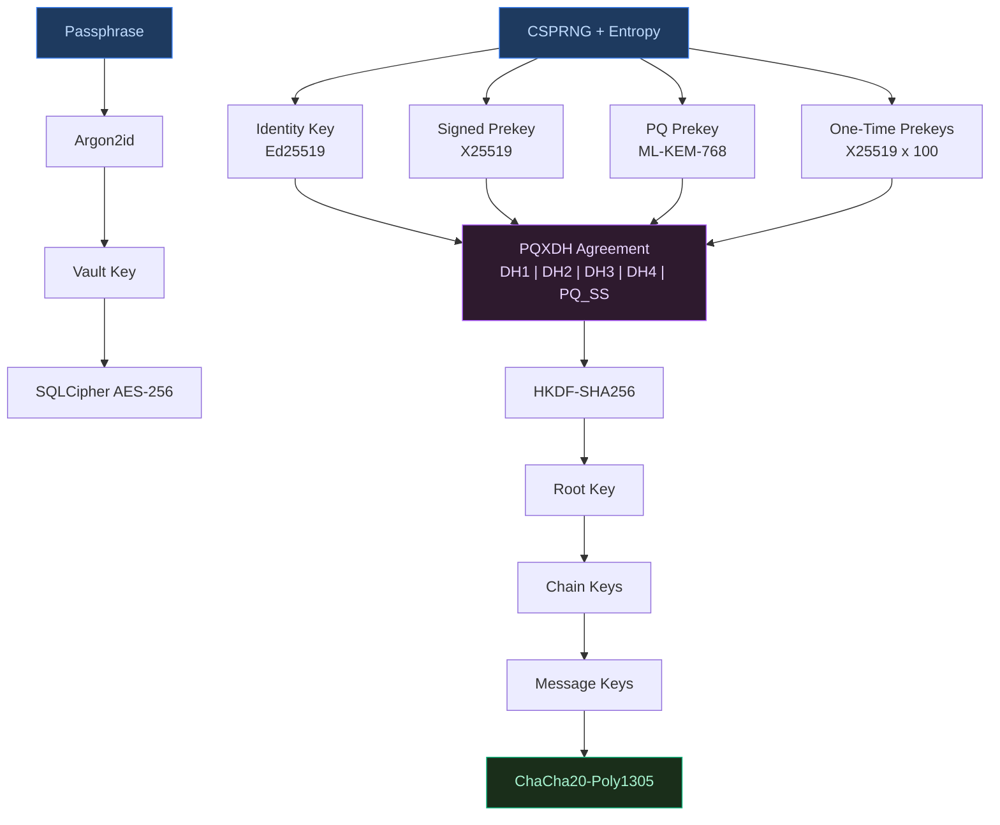
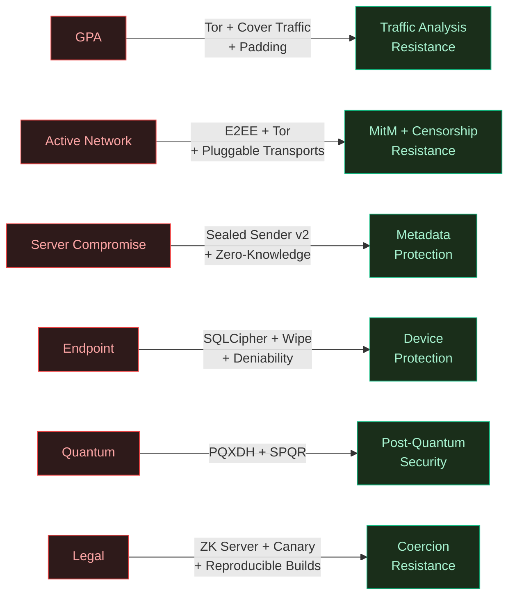

# Hades Messaging


https://github.com/user-attachments/assets/8b952b10-7954-4d8a-87a0-78d3c0c8c174

c-41ebc1d81463" />


[](https://github.com/Ashutosh0x/hades-messaging/actions/workflows/ci.yml)
[](https://github.com/Ashutosh0x/hades-messaging/actions/workflows/security-audit.yml)
[](https://github.com/Ashutosh0x/hades-messaging/actions/workflows/codeql.yml)
[](https://scorecard.dev/viewer/?uri=github.com/Ashutosh0x/hades-messaging)
[](https://github.com/Ashutosh0x/hades-messaging/actions/workflows/release.yml)

**True end-to-end encrypted messaging with zero metadata leakage**

Hades is a sovereign, privacy-first messaging application that implements state-of-the-art cryptographic protocols including post-quantum secure key exchange (PQXDH), Double Ratchet with SPQR, and forced onion routing via Tor. Unlike traditional messengers, Hades ensures that even the server infrastructure learns nothing about your communications.

---

## About

Hades is a high-fidelity, zero-trust communication system built for individuals and organizations who require absolute data sovereignty. It replaces centralized messaging services with a distributed, end-to-end encrypted architecture that runs on your own hardware.

### Key Features

- **True E2EE** -- Post-quantum secure PQXDH + Double Ratchet
- **Zero Metadata** -- Double-sealed sender, no phone numbers required
- **Tor Integration** -- Forced multi-hop onion routing with pluggable transports
- **Multi-Device** -- Sesame algorithm for device synchronization
- **Encrypted Calls** -- Voice/video with custom SRTP keying
- **Local First** -- SQLCipher encrypted local storage with Argon2id
- **No Cloud** -- Self-hostable, no AWS/GCP dependencies
- **Verifiable** -- Reproducible builds, open source
- **Anti-Forensics** -- Zeroize-on-drop, plausible deniability volumes, emergency wipe
- **Cover Traffic** -- Chaff packets and timing jitter defeat traffic analysis

---

## Tech Stack

### Client (Mobile and Desktop)


-7D4698?style=for-the-badge&logo=torproject&logoColor=white)


| Technology | Version | Purpose |
|-----------|---------|---------|
| Tauri | 2.0 | High-performance Rust-based app framework |
| Rust | 1.75+ | Memory-safe backend for cryptography and Tor |
| React | 18 | Interactive UI with Vite |
| TypeScript | 5.0 | Type-safe frontend logic |
| Framer Motion | 12 | Physics-based UI animations |
| SQLCipher | AES-256 | Encrypted-at-rest local storage |

### Security and Protocol

| Component | Implementation |
|-----------|---------------|
| Key Exchange | X25519 + ML-KEM-768 (PQXDH) |
| Symmetric Encryption | ChaCha20-Poly1305 |
| Hash | BLAKE3 |
| KDF | HKDF-SHA256 |
| Signatures | Ed25519 (Dilithium5 planned) |
| Sealed Sender | Double-sealed metadata encryption (v2) |
| Storage | SQLCipher with Argon2id |
| Onion Routing | Arti 2.0 + Vanguards-v2 |
| Pluggable Transports | Obfs4, WebTunnel, Snowflake, Meek |
| Cover Traffic | Poisson-distributed chaff packets |
| Contact Discovery | SimplePIR (planned) |
| Anonymous Auth | Blind signatures + ZK proofs |
| Anti-Forensics | Zeroize-on-drop, plausible deniability |

### Sovereign Infrastructure

| Component | Purpose |
|-----------|---------|
| NixOS | Declarative, hardened relay server deployment |
| AMD SEV-SNP | Hardware-level RAM encryption (planned) |
| ScyllaDB | High-performance isolated message routing |
| Coturn | Self-hosted E2EE media relay |

---

## Architecture

```
hades/
|-- crates/                         # Rust backend crates
|   |-- hades-crypto/               # Cryptographic primitives
|   |   |-- aead.rs                 #   ChaCha20-Poly1305
|   |   |-- anti_forensics.rs       #   Secure memory, dual volumes, emergency wipe
|   |   |-- double_ratchet.rs       #   Double Ratchet
|   |   |-- entropy.rs              #   CSPRNG seeds
|   |   |-- fingerprint.rs          #   BLAKE3 contact fingerprints
|   |   |-- kdf.rs                  #   HKDF key derivation
|   |   |-- padding.rs              #   MTU bucket padding
|   |   |-- pqxdh.rs                #   Post-quantum key exchange
|   |   |-- sealed_sender.rs        #   Sealed sender v1
|   |   |-- sealed_sender_v2.rs     #   Double-sealed envelopes (512B/8KB/64KB)
|   |
|   |-- hades-identity/             # Identity and key management
|   |   |-- anonymous_credentials.rs #   ZK auth, blind credentials
|   |   |-- fingerprint.rs          #   Safety numbers
|   |   |-- identity.rs             #   Key pair management
|   |   |-- key_bundle.rs           #   Prekey bundles
|   |   |-- key_store.rs            #   Key storage
|   |   |-- multi_device.rs         #   Device synchronization
|   |
|   |-- hades-onion/                # Tor integration
|   |   |-- bridge_rotation.rs      #   Auto-rotation (7-30d), 5 distribution methods
|   |   |-- cell.rs                 #   Fixed-size transport cells
|   |   |-- circuit.rs              #   Multi-hop encrypted tunnels
|   |   |-- cover_traffic.rs        #   Chaff packets, Poisson delays, timing jitter
|   |   |-- guard.rs                #   Guard node selection
|   |   |-- onion_encrypt.rs        #   Layered encryption
|   |   |-- pluggable_transport.rs  #   Obfs4, WebTunnel, Snowflake, Meek, Obfs5
|   |   |-- relay_node.rs           #   Individual hop in a circuit
|   |
|   |-- hades-relay/                # Message relay server
|   |-- hades-proto/                # Protocol definitions
|   |-- hades-common/               # Shared types and utilities
|
|-- client/                         # TypeScript/React frontend
|   |-- src/
|   |   |-- screens/                # App screens
|   |   |   |-- AppLock.tsx         #   Premium vault lock (Framer Motion)
|   |   |   |-- ChatList.tsx        #   Conversation list with delivery indicators
|   |   |   |-- SecureRouteIndicator.tsx # 8-stage connection establishment HUD
|   |   |   |-- Conversation.tsx    #   Message view with status per bubble
|   |   |   |-- Onboarding.tsx      #   Entropy-aware key generation
|   |   |   |-- SecurityDetails.tsx #   BLAKE3 fingerprint verification
|   |   |-- components/             # Reusable UI components
|   |   |   |-- MessageStatus.tsx   #   Animated delivery indicators (5 states)
|   |   |   |-- TypingIndicator.tsx #   Bouncing dot animation
|   |   |-- hooks/                  # React hooks
|   |   |   |-- useSecureRoute.ts   #   Secure route establishment simulation
|   |   |-- store/                  # Zustand state management
|   |   |   |-- connectionStore.ts  #   Connection state machine (status, stage)
|   |   |   |-- conversationStore.ts #  Messages with DeliveryStatus
|   |   |   |-- deviceStore.ts      #   Linked device management (auto-detect, revoke)
|   |   |   |-- securityStore.ts    #   Vault lock, fingerprints
|   |   |   |-- settingsStore.ts    #   Persistent privacy/security/network toggles
|   |   |-- types/                  # TypeScript type definitions
|   |   |   |-- message.ts          #   DeliveryStatus enum, receipt types
|   |   |-- config/                 # Constants, routes, env
|   |   |-- locales/                # i18n translations
|   |   |-- utils/                  # Time, feature flags, haptics
|   |   |-- ui/                     # Icon system
|   |   |-- design/                 # Design tokens (CSS)
|
|-- deployment/                     # Infrastructure
|   |-- configuration.nix           # NixOS hardened relay config
|
|-- docs/                           # Technical documentation
|   |-- CRYPTOGRAPHY.md             # Protocol spec with 2026 bibliography
|   |-- THREAT_MODEL.md             # 6 adversary classes, 30+ mitigations
|
|-- gen/android/                    # Generated Android project
|-- src-tauri/                      # Tauri configuration
```

---

## Architecture Diagrams

> Full diagrams with protocol details: [`docs/ARCHITECTURE.md`](docs/ARCHITECTURE.md)

### System Overview



### Message Lifecycle



### Cryptographic Key Hierarchy



### Threat Model



> See [`docs/ARCHITECTURE.md`](docs/ARCHITECTURE.md) for 23 detailed diagrams covering
> PQXDH protocol flow, Double Ratchet internals, Sealed Sender v2 envelope
> construction, onion circuit building, cover traffic mixing, multi-device
> Sesame sync, anti-forensics dual-volume, emergency wipe sequence, pluggable
> transport selection, bridge rotation, connection state machine, delivery
> state machine, CI/CD pipeline, and the complete key derivation hierarchy.

---

## Quick Start (Development)

### Prerequisites

- **Rust** 1.75+ -- [rustup.rs](https://rustup.rs/)
- **Node.js** 20+ -- [nodejs.org](https://nodejs.org/)
- **Android Studio** Latest -- [developer.android.com](https://developer.android.com/studio)
- **Java** 17+ (comes with Android Studio)

### Clone and Setup

```bash
git clone https://github.com/Ashutosh0x/hades.git
cd hades

cargo install tauri-cli

cd client && npm install
cd ..

export ANDROID_HOME=$HOME/Android/Sdk
export NDK_HOME=$ANDROID_HOME/ndk/25.2.9519653
export PATH=$PATH:$ANDROID_HOME/platform-tools:$ANDROID_HOME/tools
```

### Development Build

```bash
# Web development with hot reload
cd client && npm run dev

# Android device
npm run tauri android dev -- --device
```

### Run Rust Tests

```bash
cargo test --workspace
```

---

## Building for Production

### 1. Configure Environment

Create `.env.production`:
```env
VITE_API_URL=https://relay.hades.im
VITE_WS_URL=wss://relay.hades.im/v1/ws
VITE_ENVIRONMENT=production
VITE_FEATURE_CALLS=true
VITE_FEATURE_ANONYMOUS=true
```

### 2. Generate Release Keystore

```bash
keytool -genkeypair -v \
  -storetype PKCS12 \
  -keystore ~/hades-release.keystore \
  -alias hades \
  -keyalg RSA \
  -keysize 4096 \
  -validity 10000
```

Back up `hades-release.keystore` to multiple secure locations. If you lose this key, you can never update the app.

### 3. Configure Signing

Create `gen/android/keystore.properties`:
```properties
storePassword=YOUR_STORE_PASSWORD
keyPassword=YOUR_KEY_PASSWORD
keyAlias=hades
storeFile=/path/to/hades-release.keystore
```

### 4. Build

```bash
# App Bundle (Play Store)
npm run tauri android build -- --aab

# Split APKs (direct distribution)
npm run tauri android build -- --apk --split-per-abi

# Verify signature
apksigner verify --verbose --print-certs \
  gen/android/app/build/outputs/apk/release/app-arm64-v8a-release.apk
```

---

## Security Model

For the complete protocol specification, see [docs/CRYPTOGRAPHY.md](docs/CRYPTOGRAPHY.md).
For the full threat model, see [docs/THREAT_MODEL.md](docs/THREAT_MODEL.md).

### Threat Mitigation Summary

| Threat | Mitigation |
|--------|------------|
| Server compromise | E2EE, double-sealed sender, zero metadata design |
| Network surveillance | Forced Tor routing, pluggable transports, cover traffic |
| Traffic analysis | MTU bucketing (512B/8KB/64KB), Poisson chaff, timing jitter |
| Device compromise | SQLCipher + Argon2id, zeroize-on-drop, emergency wipe |
| Physical seizure | Plausible deniability dual-volume, AMD SEV-SNP (planned) |
| Quantum computing | PQXDH (X25519 + ML-KEM-768), SPQR ratchet injection |
| Legal coercion | Zero-knowledge server, reproducible builds, warrant canary (planned) |
| Censorship | Obfs4, WebTunnel, Snowflake, bridge auto-rotation |
| Social graph inference | SimplePIR contact discovery (planned), sealed sender |

### Network Security

```xml
<network-security-config>
    <domain-config cleartextTrafficPermitted="false">
        <domain includeSubdomains="true">relay.hades.im</domain>
        <pin-set>
            <pin digest="SHA-256">YOUR_CERTIFICATE_PIN</pin>
        </pin-set>
    </domain-config>
</network-security-config>
```

---

## Sovereignty Mode

Hades is designed to run without a single cloud provider.

1. **Bare Metal** -- Deploy the relay on your own AMD EPYC hardware with SEV-SNP
2. **NixOS** -- Use `deployment/configuration.nix` to declare your entire server state
3. **Onion Identity** -- Your relay is identified by a `.onion` address, immune to DNS filtering
4. **Media Relay** -- Self-hosted Coturn for E2EE voice/video calls
5. **Stateless** -- Relay stores zero persistent data; ScyllaDB handles only transient routing

### Recommended Deployment Regions

| Tier | Location | Rationale |
|------|----------|-----------|
| Primary | Iceland | Strongest privacy laws in the West |
| Primary | Switzerland | Federal Data Protection Act |
| Secondary | Romania | EU GDPR, no mandatory data retention |
| Fallback | P2P (libp2p) | No server dependency |

---

## Documentation

| Document | Contents |
|----------|----------|
| [ARCHITECTURE.md](docs/ARCHITECTURE.md) | 23 Mermaid diagrams: system overview, client architecture, crate graph, component tree, PQXDH, Double Ratchet, Sealed Sender v2, message lifecycle, Tor circuits, cover traffic, identity management, Sesame sync, anti-forensics, deployment, state machines, CI/CD pipeline, threat model, data flow, key hierarchy |
| [CRYPTOGRAPHY.md](docs/CRYPTOGRAPHY.md) | 16-algorithm protocol table, PQXDH, Double Ratchet, MLS, AKD, SimplePIR, Sealed Sender v2, 2026 research bibliography |
| [THREAT_MODEL.md](docs/THREAT_MODEL.md) | 6 adversary classes (GPA, active network, server compromise, endpoint, quantum, legal), 30+ mitigations with implementation status |

---

## Release Checklist

### Code Quality
- All tests passing (`cargo test --workspace && cd client && npm test`)
- No hardcoded values (API keys, URLs, strings)
- Security audit passed (`cargo audit && npm audit`)

### Version Updates
- `package.json` version updated
- `tauri.conf.json` version updated
- `build.gradle` versionCode/versionName updated
- CHANGELOG.md updated

### Build and Testing
- Release APK builds successfully
- Tested on minimum API level (26)
- Tested on latest API level
- ProGuard rules verified

### Security
- APK signed with release key
- Certificate fingerprints documented
- Network security config updated
- No debug logs in release build
- Keystore backed up in 3+ locations

### Distribution
- SHA256 checksums generated
- GPG signatures created
- GitHub release drafted
- Play Store listing updated

---

## CI/CD Pipeline

Hades uses a comprehensive GitHub Actions pipeline:

| Workflow | Trigger | Purpose |
|----------|---------|--------|
| **CI** | Push/PR | Rust fmt, clippy, tests (Linux/macOS/Windows), coverage, frontend lint/test/build |
| **Security Audit** | Daily + push | cargo-audit, cargo-deny, npm audit, license compliance |
| **CodeQL** | Push/PR + weekly | SAST for TypeScript and Actions workflows |
| **OpenSSF Scorecard** | Weekly + main push | Supply chain security health metrics |
| **Dependency Review** | PR | Block vulnerable/copyleft deps before merge |
| **Container Scan** | Weekly + push | Trivy filesystem and IaC scanning |
| **NixOS Check** | Push to deployment/ | Validate relay server NixOS configuration |
| **Release** | Tag push (vX.Y.Z) | Full build → sign → attest → publish with SLSA provenance |

### Required Repository Secrets

| Secret | Description |
|--------|-------------|
| `ANDROID_KEYSTORE_BASE64` | Base64-encoded `hades-release.keystore` |
| `ANDROID_KEYSTORE_PASSWORD` | Keystore password |
| `ANDROID_KEY_PASSWORD` | Key password |
| `CODECOV_TOKEN` | Token from codecov.io |

Generate the keystore secret:
```bash
base64 -w0 ~/hades-release.keystore | pbcopy  # macOS
base64 -w0 ~/hades-release.keystore | xclip    # Linux
```

---

## Contributing

See [CONTRIBUTING.md](CONTRIBUTING.md) for development setup, coding standards, and submission process.

### Security Vulnerabilities

**DO NOT** open public issues for security vulnerabilities. Email security@hades.im with:
- Description of the vulnerability
- Steps to reproduce
- Potential impact
- Suggested fix (if any)

---

## License

Licensed under the **MIT License**. See [LICENSE](LICENSE) for details.

### Third-Party Licenses

- [Tauri](https://github.com/tauri-apps/tauri) -- MIT/Apache-2.0
- [vodozemac](https://github.com/matrix-org/vodozemac) -- Apache-2.0
- [arti](https://gitlab.torproject.org/tpo/core/arti) -- MIT/Apache-2.0
- [framer-motion](https://github.com/framer/motion) -- MIT

---

## Support

- **Documentation**: [docs.hades.im](https://docs.hades.im)
- **Community**: [Matrix](https://matrix.to/#/#hades:matrix.org)
- **Email**: support@hades.im
- **Security**: security@hades.im

---

**True Privacy is Sovereignty.**
